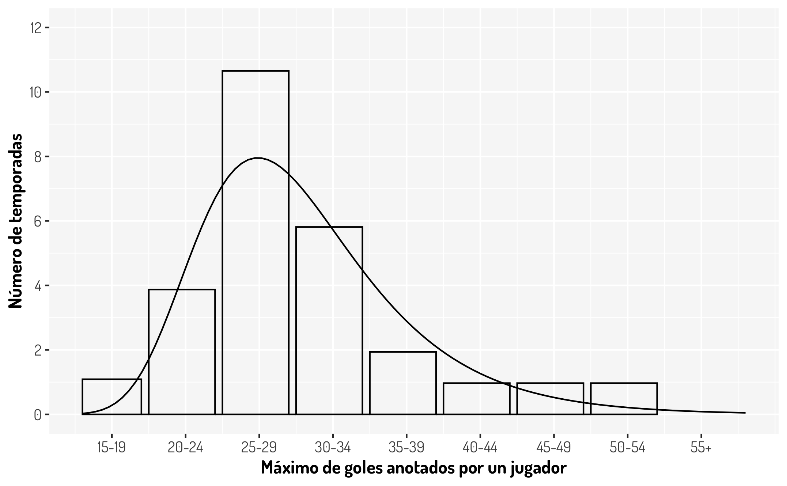

# (PART) Estadística no paramétrica  {-}

# Pruebas de hipótesis

```{css, echo=FALSE}
pre {
  max-height: 300px;
  overflow-y: auto;
}

pre[class] {
  max-height: 300px;
}
```


Una de las técnicas más poderosas con las que contamos para determinar la certeza de una idea, son las pruebas de hipótesis y en este apartado veremos un resumen acerca de todo lo que implica hacer una prueba de hipótesis junto con los puntos más importantes a tener en cuenta sobre las conclusiones y las decisiones que se toman a la hora de realizar esta técnica estadística.

## ¿Qué es una Prueba de Hipótesis?

Vamos a ver muchas definiciones a lo largo de esta sección y en esta en particular vamos a citar diferentes versiones que se pueden encontrar en varias fuentes populares.

> "Una prueba de hipótesis es el proceso de inferir desde una muestra si una afirmación determinada sobre la población parece ser cierta o no." @conover1999practical

> "Una hipótesis estadística es una sentencia sobre la naturaleza de una población. Por lo general, se formula en términos de un determinado parámetro de la población." @ross2005introduccion

> "La prueba de hipótesis en estadística es una forma de probar los resultados de una encuesta o experimento para ver si tiene resultados significativos. Básicamente, está probando si sus resultados son válidos calculando las probabilidades de que sus resultados hayan ocurrido por casualidad. Si sus resultados pueden haber ocurrido por casualidad, el experimento no será repetible y, por lo tanto, tiene poca utilidad." (StatisticsHowTo.com)

>"Testing in a nutshell: “Does our evidence make the null hypothesis look ridiculous?”". (Cassie Kozyrkov, 2018 desde Towards Data Science)

Como vemos, hay muchas fuentes interesantes y de cada una obtenemos cosas muy interesantes, así que vamos a dar algunas otras definiciones importantes con diferentes interpretaciones.

## Dos tipos de hipótesis

Es cierto que los tipos de hipótesis que existen son *simple* y *compuesta*, pero eso no nos interesa por el momento. 

Para realizar una prueba de hipótesis necesitamos una sentencia con la que vamos a determinar un comportamiento sobre la muestra (los datos) y su complemento. A la primera la llamaremos **Hipótesis nula** y a la complementaria **Hipótesis alternativa**; estas quedan codificadas como $H_0$ y $H_1$ respectivamente y lo que siempre vamos a hacer en una prueba de hipótesis es determinar si podemos _rechazar con la información disponible la hipótesis nula_ y esto siempre se expresará de la siguiente manera:

$$
\begin{array}{lcr}
H_0  & vs & H_1
\end{array}
$$

A lo anterior se le llama **regla de decisión**. En este proceso vamos a tener que aplicar algunos _supuestos_ sobre la población (vamos a considerar que son ciertos), como la distribución de la muestra, y estos van a recaer sobre la _hipótesis nula_ y en base a esto, la prueba determinará algo sobre esta hipótesis: "La podemos rechazamos o no podemos". Para que suceda lo primero, vamos a necesitar evidencia de que nuestros datos se comportan en mayor medida como lo que establece la hipótesis alternativa y si esto pasa diremos que se *rechaza la hipótesis nula*. En caso contrario, sólo podremos decir que *No existe información suficiente para rechazar la hipótesis nula*. Véase que todo es sobre la $H_0$.

Algunos ejemplos sencillos que podemos pensar sobre las pruebas de hipótesis son:

$$
\begin{array}{ccc}
H_0: \mbox{Plutón es un planeta}  & vs & H_1: \mbox{Plutón no es un planeta}\\
H_0: \mbox{La nueva droga no tuvo algún efecto}  & vs & H_1: \mbox{La nueva droga tuvo algún efecto}\\
H_0: \mbox{Existe la relación #Cigueñas-#Bebes} & vs & H_1: \mbox{No existe la relación #Cigueñas-#Bebes}\\
\end{array}
$$

¿Ya se noto que en los ejemplos lo que se desea es rechazar la hipótesis nula? Esto no es coincidencia ya que es lo que buscamos generalmente (¡esto no sucede siempre!), ¿Por qué? Piensa lo siguiente:

+ No podemos afirmar la certeza de algo cuando suponemos que es cierta
+ Si no encontramos como rechazar algo, ¿Significa que entonces es cierto o que simplemente no encontramos la forma de rechazarlo? 

De hecho, históricamente Fisher consideró a la hipótesis nula como aquella que uno intenta desacreditar. En la palabras de Fisher: "Puede decirse que todos los experimentos se diseñan para poder asignar una probabilidad al hecho de que los resultados se opongan a la hipótesis nula" @ross2005introduccion

Aquí se deja otro tipo de hipótesis comunes en términos matemáticos

$$
\begin{array}{ccc}
H_0: p = p^*  & vs & H_1: p \neq p^*\\
H_0: X\sim N(0,1)  & vs & H_1: X\nsim N(0,1)\\
H_0: \mathbb{P}(X, Y) = \mathbb{P}(X)\mathbb{P}(Y) & vs & H_1:  \mathbb{P}(X, Y) \neq \mathbb{P}(X)\mathbb{P}(Y)\\
\end{array}
$$

Ahora, para cada prueba se tendrá algo específico que cambiará la forma de llevar a cabo esta, y esto se consigue con el **Estadístico**, que no hay que olvidar que un estadístico no es más que un valor que se determina con la información obtenida (los datos, la muestra) y como al inicio pensamos que la hipótesis nula se cumple, este tendrá alguna distribución específica, ya sea una distribución $N(\mu, \sigma)$, $t_{(m)}$, $\chi^2_{(m)}$, $F_{(m)}$, etc. Véase que este entonces tendrá toda la información de la muestra y no tendrá alguna preferencia sobre la hipótesis $H_0$ o $H_1$. Sí bien es cierto que esta pensado en que la hipótesis nula es cierta, la propia muestra nos puede dar evidencia estadística de que nuestra muestra tiene un comportamiento diferente.

No hay que olvidar que estamos tratando de hacer inferencia con datos que bien pudieron ser alterados por el propio azar, por lo que siempre damos una tolerancia a que sucedan **eventos no significativos**.

## Significancia y confianza

¿Qué significa que un evento sea estadísticamente significante o que no lo sea? Creo que esta referencia nos puede ser de utilidad

> "La importancia estadística ayuda a cuantificar si un resultado es probable que se deba al azar o a algún factor de interés" (Amy Gallo, A Refresher on Statistical Significance).

Es decir, si tenemos que una observación no es estadísticamente significante, es porque fue generada por factores externos que la mayoría de la población no tuvo, o bien pudo ser debido simplemente por el azar. Con esto, nosotros podemos establecer un margen para permitir este tipo de observaciones, ya que establecer que nuestras conclusiones en base a nuestra prueba sucederán **siempre** es algo atrevido; no hay que olvidar que en primera estamos trabajando bajo variables aleatorias, por lo que siempre se pueden tener distintos valores en diferentes ocasiones bajo una distribución establecida y que estamos trabajando con una muestra que suponemos significativa de la población, por lo que alguien en la población podría ser especial y comportarse de manera distinta.

La **significancia** de la prueba la denotaremos como $\alpha$ y es común ver en libros de texto que esta se establece con un nivel del 5%, es decir que $\alpha = 0.05$. Esto hace que permitamos que el 5% de nuestros resultados no sigan a la hipótesis $H_0$. Al complemento, $1-\alpha$, le llamaremos **nivel de confianza** y este nos dirá, valga la redundancia, cuando debemos confiar en nuestra prueba. Si por ejemplo tenemos un $\alpha  = 0.1$, significa que estamos permitiendo que 1/10 observaciones no obedezca a la hipótesis nula, por lo que 9/10 ($1-\alpha$) observaciones sí lo hacen.

¿Qué tan pequeña o grande debe ser la significancia de la prueba? Eso depende de cada investigador o quien este realizando la prueba. Es común dar un nivel del 5% pero aveces se prefiere más exactitud y se toma un 1%; tal vez no se desea ser tan riguroso o asumir un riesgo grande, así tal vez $\alpha$ podría valer 10%, etc. Un caso interesante es la exactitud con la que algunos estudios en física se realizan, por ejemplo para determinar que tan extraño es encontrar un boson de Higgs se considera una probabilidad de $3X10^-{7}$, a lo cual lo llaman 5 sigmas y esto queda claro cuando se entiende que $\sigma$ representa la cantidad de desviaciones estandar de una normal.

## Rechazar $H_0$

Vale, ya quedo establecido que en general nos enfocamos en contradecir la hipótesis nula ¿Cómo lo hacemos?
Esto va a depender de que tipo de prueba estemos realizando pero esto lo veremos más adelante, por el momento vamos a considerar un ejemplo sencillo.

Supongamos que tenemos una muestra aleatoria y representativa de tamaño 20 que se distribuye $N(\mu,\sigma = 4)$, tal vez esta represente las mediciones sobre la fuerza de una máquina, la intensidad de una señal o la edad en un cierto cohorte. Lo que se quiere determinar es si la media (la esperanza) es mayor a cierto valor, supongamos 10.

Con esta información podemos determinar que estamos ante un contraste de medias de una población normal y formular lo siguiente

$$
\begin{array}{ccc}
H_0: \mu \leq \mu_0 = 10  & vs & H_1: \mu > \mu_0 = 10
\end{array}
$$

donde el estadístico $T = \frac{|\bar{X}-\mu_{0}|}{\sigma/\sqrt{n}} \sim N(0,1)$. En este caso tendríamos que $T = 1.79$. ¿Cómo se ve esto gráficamente?

```{r}
tibble(x = c(-4.5, 4.5)) %>% #Creamos unos datos que nos ayuden a colocar los ejes
  ggplot(aes(x = x)) + #Creamos una hoja para agregar elementos gráficos
  stat_function(fun = ~dnorm(x = .x)) + # Dibujamos una curva de acuerdo a una función
  geom_segment(x = 1.79, xend = 1.79, y = 0, yend = dnorm(1.79), color = "#1854a8") + #Estadístico
  labs(y = "Densidad") +
  ggtitle(TeX("N(0,1)")) + 
  general_theme #Sólo agregamos más diseño
```

Y ¿Cómo se vería representado el nivel de significancia? Para responder esto tenemos que recurrir al cuantil en el cual se alcanza la significancia establecida, en este caso es del 5% por lo que $Z_q = Z_{1- 0.05} =$ `r qnorm(0.05, lower.tail = F)`.

```{r}
cuantil <- qnorm(0.05, lower.tail = F)
tibble(x = c(-4.5, 4.5)) %>% #Creamos unos datos que nos ayuden a colocar los ejes
  ggplot(aes(x = x)) + #Creamos una hoja para agregar elementos gráficos
  stat_function(fun = ~dnorm(x = .x)) + # Dibujamos una curva de acuerdo a una función
  geom_segment(x = 1.79, xend = 1.79, y = 0, yend = dnorm(1.79), color = "#1854a8") + #Estadístico
  geom_segment(x = cuantil, xend = cuantil, y = 0, yend = dnorm(cuantil), color = "red") + #Cuantil
  stat_function(fun = ~under_curve(type = "greater", 0.05 ,.x, dnorm, qnorm), geom = 'area', fill = "red", alpha = 0.2) + #Una función para rellenar la zona de rechazo
  labs(y = "Densidad") +
  ggtitle(TeX("N(0,1)")) + 
  general_theme #Sólo agregamos más diseño
```

Lo que nos esta diciendo la gráfica anterior es, que nuestro estadístico, el cual se distribuye de la misma forma que la gráfica de densidad, cae dentro de una zona en la cual nosotros establecimos que deberían estar los eventos no significantes, y como nuestro estadístico es un resumen completo de la muestra, tenemos evidencia para rechazar la hipótesis nula, en nuestro contexto se tendría que los datos muestran que la media sí es más grande que 10. A la zona coloreada en rojo se le llama **región de rechazo** o **región crítica** y queda definida como los valores con los cuales se debe rechazar la hipótesis nula.

¿Qué hubiera sucedido si se hubiera definido $\alpha = 0.01$? Aquí te dejo la gráfica

```{r, echo=FALSE}
cuantil <- qnorm(0.01, lower.tail = F)
tibble(x = c(-4.5, 4.5)) %>% #Creamos unos datos que nos ayuden a colocar los ejes
  ggplot(aes(x = x)) + #Creamos una hoja para agregar elementos gráficos
  stat_function(fun = ~dnorm(x = .x)) + # Dibujamos una curva de acuerdo a una función
  geom_segment(x = 1.79, xend = 1.79, y = 0, yend = dnorm(1.79), color = "#1854a8") + #Estadístico
  geom_segment(x = cuantil, xend = cuantil, y = 0, yend = dnorm(cuantil), color = "red") + #Cuantil
  stat_function(fun = ~under_curve(type = "greater", 0.01 ,.x, dnorm, qnorm), geom = 'area', fill = "red", alpha = 0.2) + #Una función para rellenar la zona de rechazo
  labs(y = "Densidad") +
  ggtitle(TeX("N(0,1)")) + 
  general_theme #Sólo agregamos más diseño
```

NOTA: Estos conceptos son análogos para otras distribuciones que requieren otro tipo de pruebas.

## Tipos de pruebas

Como ya vimos que debemos comparar un cuantil contra nuestro estadístico para determinar si rechazamos una hipótesis nula, es útil considerar no sólo el enfoque anterior, si no los otros casos. En la siguiente lista se dejan los otros tipos de prueba junto con el nombre que reciben.

+ $H_0: \mu = \mu_0 = 10 \ vs \ H_1: \mu \neq \mu_0 = 10$. Prueba de dos colas
+ $H_0: \mu \geq \mu_0 = 10 \ vs \ H_1: \mu < \mu_0 = 10$. Prueba de cola izquierda
+ $H_0: \mu \leq \mu_0 = 10 \ vs \ H_1: \mu > \mu_0 = 10$. Prueba de cola derecha

Creo que la mejor explicación para los nombres de estas pruebas es ver como se comportarían gráficamente las regiones de rechazo

```{r, echo=FALSE}
cuantilLeft <- qnorm(0.05)
cuantilRight <- qnorm(0.05, lower.tail = F)
cuantilDouble <- c(qnorm(0.05/2),qnorm(0.05/2, lower.tail = F))
left_plot <- 
tibble(x = c(-4.5, 4.5)) %>% #Creamos unos datos que nos ayuden a colocar los ejes
  ggplot(aes(x = x)) + #Creamos una hoja para agregar elementos gráficos
  stat_function(fun = ~dnorm(x = .x)) + # Dibujamos una curva de acuerdo a una función
  geom_segment(x = cuantilLeft, xend = cuantilLeft, y = 0, yend = dnorm(cuantilLeft), color = "red") + #Cuantil
  stat_function(fun = ~under_curve(type = "less", 0.05 ,.x, dnorm, qnorm), geom = 'area', fill = "red", alpha = 0.2) + #Una función para rellenar la zona de rechazo
  labs(y = "Densidad") +
  ggtitle("Cola inferior") + 
  general_theme #Sólo agregamos más diseño
right_plot <- 
tibble(x = c(-4.5, 4.5)) %>% #Creamos unos datos que nos ayuden a colocar los ejes
  ggplot(aes(x = x)) + #Creamos una hoja para agregar elementos gráficos
  stat_function(fun = ~dnorm(x = .x)) + # Dibujamos una curva de acuerdo a una función
  geom_segment(x = cuantilRight, xend = cuantilRight, y = 0, yend = dnorm(cuantilRight), color = "red") + #Cuantil
  stat_function(fun = ~under_curve(type = "greater", 0.05 ,.x, dnorm, qnorm), geom = 'area', fill = "red", alpha = 0.2) + #Una función para rellenar la zona de rechazo
  ggtitle("Cola superior") + 
  labs(y = NULL) + 
  general_theme #Sólo agregamos más diseño
two_plot <- 
tibble(x = c(-4.5, 4.5)) %>% #Creamos unos datos que nos ayuden a colocar los ejes
  ggplot(aes(x = x)) + #Creamos una hoja para agregar elementos gráficos
  stat_function(fun = ~dnorm(x = .x)) + # Dibujamos una curva de acuerdo a una función
  geom_segment(x = cuantilDouble, xend = cuantilDouble, y = 0, yend = dnorm(cuantilDouble), color = "red") + #Cuantil
  stat_function(fun = ~under_curve(type = "two.sided", 0.05 ,.x, dnorm, qnorm), geom = 'area', fill = "red", alpha = 0.2) + #Una función para rellenar la zona de rechazo
  ggtitle("Dos colas") + 
  labs(y = NULL) + 
  general_theme #Sólo agregamos más diseño
left_plot + right_plot + two_plot

```

Ahora, aquí hay algo importante. En una prueba donde se esta asumiendo una distribución simétrica y se desea contrastar una hipótesis del estilo $H_0: \mu = \mu_0 \ vs \ H_1: \mu \neq \mu_0$, por lo que se debe considerar tal cual el efecto de simetría, ya que realmente las pruebas están diseñadas para medir la separación entre un valor teórico y un valor dado, en este caso hablamos de las medias, por lo que la simetría afectará a este tipo de pruebas y más en este caso en que la simetría hace que existan valores negativos que, al tomar el valor absoluto entre la diferencia de las medias, duplicarán la probabilidad. De hecho, lo que se hace en estos casos es considerar $\alpha = \alpha_1 + \alpha_2$, en general se considera $\alpha/2$. En este caso en particular se tiene que los cuantiles para una normal estandar se calculan con $\alpha/2$ ($Z_{\alpha/2}$) de probabilidad para cada cola correspondiente.

Entonces, sin ver las regiones de rechazo ¿Qué concluirías de los siguientes resultas gráficos si estos representan una prueba de hipótesis como las que se han visto en este material?

```{r, echo=FALSE}
tibble(x = c(-4.5, 4.5)) %>% #Creamos unos datos que nos ayuden a colocar los ejes
  ggplot(aes(x = x)) + #Creamos una hoja para agregar elementos gráficos
  stat_function(fun = ~dnorm(x = .x)) + # Dibujamos una curva de acuerdo a una función
  geom_segment(x = 0.5, xend = 0.5, y = 0, yend = dnorm(0.5), color = "#1854a8") + #Estadístico
  labs(y = "Densidad") +
  ggtitle(TeX("N(0,1)")) + 
  general_theme #Sólo agregamos más diseño
```


## $P-value$

Una de las herramientas más comunes de utilizar en una prueba de hipótesis es algo llamado $p-value$, que no es más que una probabilidad que cambia de acuerdo a la prueba:

+ Dos colas: $2*min(\mathbb{P}(X<T), \mathbb{P}(X>T))$ 
+ Cola izquierda: $\mathbb{P}(X<T)$
+ Cola derecha: $\mathbb{P}(X>T)$

Como se puede apreciar, el $p-value$, dando que la hipótesis nula es cierta, es la probabilidad de obtener valores "más grandes" o mejor dicho una diferencia igual o más extrema que nuestro estadístico, es decir que la observada; en el caso de una prueba de dos colas se aplica un criterio similar a la razón del porque se considera un $\alpha /2$. ¿Cómo se vería este gráficamente en la prueba anterior?

```{r}
cuantil <- qnorm(0.05, lower.tail = F)
tibble(x = c(-4.5, 4.5)) %>% #Creamos unos datos que nos ayuden a colocar los ejes
  ggplot(aes(x = x)) + #Creamos una hoja para agregar elementos gráficos
  stat_function(fun = ~dnorm(x = .x)) + # Dibujamos una curva de acuerdo a una función
  geom_segment(x = 1.79, xend = 1.79, y = 0, yend = dnorm(1.79), color = "#1854a8") + #Estadístico
  geom_segment(x = cuantil, xend = cuantil, y = 0, yend = dnorm(cuantil), color = "red") + #Cuantil
  stat_function(fun = ~under_curve(type = "greater", 0.05 ,.x, dnorm, qnorm), geom = 'area', fill = "red", alpha = 0.2) + #Una función para rellenar la zona de rechazo
  stat_function(fun = ~under_curve(type = "greater",  1-pnorm(1.79),.x, dnorm, qnorm), geom = 'area', fill = "blue", alpha = 0.2) + #Una función para el p-value
  labs(y = "Densidad") +
  ggtitle(TeX("N(0,1)")) + 
  general_theme #Sólo agregamos más diseño
```

La zona coloreada con azul es el $p-value$. Observase que esta probabilidad esta ligada al estadístico y que, con el nivel de confianza establecido, se tiene que $p-value<\alpha$. De hecho, otra manera muy común de rechazar las pruebas de hipótesis es con el siguiente criterio.

$$
Se \ \ rechaza \ \ H_0 \ \ cuando \ \ p-value<\alpha
$$

Ya que el $p-value$ es calculado de diferente manera para cada prueba, no es necesario saber si es de cola izquierda, derecha o de dos colas para sólo rechazar la hipótesis nula. De hecho, es común que en las funciones que tiene `R` para hacer pruebas de hipótesis como `t.test()`, `binom.test()`, `chisq.test()`, etc. no se muestre el cuantil con el cual se debe contrastar el estadístico. ¿Esto esta bien?

Aquí hay un gran debate sobre el mal uso de los $p-values$, ya que hay que mencionar que una prueba de hipótesis debería rechazarse con el contraste de un estadístico contra un cuantil, ya que el $p-value$ sólo es una herramienta que aveces puede hacernos tomar decisiones equivocadas. ¿Conoces algún ejemplo donde el $p-value$ indique una conclusión errónea? 

Además, ¿Qué pasas si nuestro $p-value$ resulto un valor muy cercano a $\alpha$ como $0.049$? ¿Rechazamos? ¿No habrá sido este resultado tan pequeño debido al azar en algunas observaciones? Es real que existe una tendencia a darle preferencia al $p-value$ en un sentido muy estricto en lugar de pensar en la creación y entendimiento de la prueba. De hecho The American Statistical Association aconseja y pide evitar los $p-values$, ya que se han dado muchos casos en los que los experimentos se han modificado obteniendo más muestras (o tal vez hasta sesgando el experimento) hasta conseguir un $p-value<0.05$, lo cual le quita toda validez a uno de los principales supuestos que tiene una prueba de hipótesis: La muestra es aleatoria y representativa de la población.

Si quieres ver un poco más de todo lo que he mencionado sobre los $p-values$, puedes consultar los siguientes enlaces:

+ [Science world's p-value controversy: Little number, big problem](https://ottawacitizen.com/technology/science/science-worlds-p-value-controversy-little-number-big-problem)
+[The problem with p-values](https://aeon.co/essays/it-s-time-for-science-to-abandon-the-term-statistically-significant)
+ [Statisticians Found One Thing They Can Agree On: It’s Time To Stop Misusing P-Values](https://fivethirtyeight.com/features/statisticians-found-one-thing-they-can-agree-on-its-time-to-stop-misusing-p-values/)
+ [We're All 'P-Hacking' Now](https://www.wired.com/story/were-all-p-hacking-now/)
+ [Data dredging](https://en.wikipedia.org/wiki/Data_dredging)


Otras preguntas interesantes sobre la prueba de hipótesis son las siguientes:

+ Si hacemos muchas pruebas de hipótesis a la vez, ¿No se altera de alguna forma la exactitud de la prueba?
+ Si sabemos que rechazamos una prueba tomamos otra que por complemento no se rechaza ¿Esta bien hacerlo?
+ Hay propuestas diferentes para evitar el $p-value$
+ Si tengo dos pruebas de hipótesis que me dan conclusiones similares ¿Cuál debería elegir para mostrar con mayor exactitud los valores del estadístico y el cuantil?
+ ¿El tamaño de muestra afecta a la prueba de hipótesis?

Y para finalizar, aquí se dejan algunos enlaces interesantes

+ [Basic concepts of hypothesis testing](http://www.biostathandbook.com/hypothesistesting.html)
+ [Failing to Reject the Null Hypothesis](https://statisticsbyjim.com/hypothesis-testing/failing-reject-null-hypothesis/)
+ [A Refresher on Statistical Significance](https://hbr.org/2016/02/a-refresher-on-statistical-significance)
+ [5 Sigma What's That?](https://blogs.scientificamerican.com/observations/five-sigmawhats-that/)
+ [Statistics for people in a hurry](https://towardsdatascience.com/statistics-for-people-in-a-hurry-a9613c0ed0b)
+ [Explaining p-values with puppies](https://hackernoon.com/explaining-p-values-with-puppies-af63d68005d0)
+ [A lot of bad statistics in one picture](https://sciprincess.wordpress.com/2019/10/27/a-lot-of-bad-statistics-in-one-picture/)

## Algunos puntos a recordar

+ **No rechazar la hipótesis nula no significa aceptarla**. Recordemos que sólo podemos asegurar un hecho cuando la muestra tenga información tal que con la hipótesis nula tomada como cierta, el estadística caiga en la región de rechazo o cuando el $p-value$ sea pequeño. En caso contrario sólo podemos decir que **"NO HAY INFORMACIÓN SUFICIENTE PARA RECHAZAR LA HIPÓTESIS $H_0$"**, lo cual es muy diferente a aceptarla.

+ **En general, deseamos rechazar la hipótesis nula**. Si la única forma viable de aceptar algo con una prueba de hipótesis es rechazando la hipótesis nula, lo ideal es formular la prueba para que esto suceda; claro, siempre que se pueda.

+ **La formulación de la prueba puede llevar un proceso**. Muchas veces, por la información o los enunciados que se desean verificar, se puede formular la hipótesis de manera errónea, ya que hay que recordar bien como están construidas las hipótesis $H_0$ y $H_1$ para aplicar dicha prueba. Aveces tener una solución equivalente será lo ideal.

+ **Datos para realizar la prueba**. Depende de cada prueba, se necesitarán distintos elementos numéricos. Asegurarte de tener al menos los necesarios para realizar la prueba sin tener que crear más suposiciones.

+ **La significancia y la muestra pueden afectar la prueba**. Recordemos que por convención se da un $\alpha = 0.05$, lo cual no es estrictamente necesario. Otro punto importante es que si la muestra es muy pequeña, puede afectar el resultado de la prueba así como el $p-value$ y peor aún si la muestra no es representativa. En este último caso las pruebas no tendrán validez alguna.

# Pruebas binomiales y de rangos

```{css, echo=FALSE}
pre {
  max-height: 300px;
  overflow-y: auto;
}

pre[class] {
  max-height: 300px;
}
```

+ [Mann-Whitney U Test in R](https://stat-methods.com/home/mann-whitney-u-r/)
+ [Probability, Statistics, and Data: A fresh approach using R: Rank Based Tests](https://mathstat.slu.edu/~speegle/_book/RBT.html#effectsizeconsistency)
+ [JABSTB: Statistical Design and Analysis of Experiments with R: Sign Rank](https://tjmurphy.github.io/jabstb/signrank.html)

# Tablas de contingencia

```{css, echo=FALSE}
pre {
  max-height: 300px;
  overflow-y: auto;
}

pre[class] {
  max-height: 300px;
}
```

Además de la manera clásica que tenemos en R para generar una tabla de contingencia con `base::table()` podemos nosotros generar esta. Aquí se dejan tres maneras de hacer una tabla de contingencia apropiada con un data frame, para esto utilizaremos una bas da datos pública con datos de 120 años de las olimpiadas (Athens 1896-Rio 2016) obtenidos de este [enlace](https://www.kaggle.com/heesoo37/120-years-of-olympic-history-athletes-and-results).

```{r}
olympics <- read_csv("athlete_events.csv") %>% distinct()
olympics
```

Nuestro objetivo por el momento es obtener una tabla de contingencia donde se relacionen el tipo de medallas y la edad de los que obtuvieron una medalla. La primera propuesta es determinar cuantas medallas se obtuvieron por edad para después separar los datos por las distintas edades y con cada uno de esos datos obtener cuantas medallas de bronce, plata y oro se obtuvieron incluyendo los casos donde no se tiene registro de algún participante con cierta edad que haya ganado algún tipo específico de medalla.

```{r}
get_n <- function(df, Medalla){
  nu <- df %>% filter(Medal == Medalla)
  if(dim(nu)[1] == 0){
    return(integer(1))
  }else{
    return(nu$n)
  }
}

medals_by_age <- olympics %>% filter(!is.na(Medal) & !is.na(Age)) %>% 
  group_by(Age) %>% count(Medal) %>%
  nest() %>% 
  mutate(Bronze = map_int(data, ~get_n(.x,"Bronze")), 
         Silver = map_int(data, ~get_n(.x,"Silver")),
         Gold = map_int(data, ~get_n(.x,"Gold"))) %>% 
  dplyr::select(-data)

medals_by_age
```

En la siguiente propuesta se obtendrá el resultado anterior de una manera sencilla, así que primero se muestra antes de crear la tabla de contingencia.

```{r}
medals_by_age <- olympics %>% filter(!is.na(Medal) & !is.na(Age)) %>%
  group_by(Age, Medal) %>%
  tally() %>% 
  spread(Medal, n, fill = 0)

medals_by_age
```

Ya con este resultado, es sencillo crear nuestra tabla de contingencia

```{r}
table_medals <- matrix(c(medals_by_age$Bronze, medals_by_age$Silver, medals_by_age$Gold), 
                       nrow = 3, byrow = T)
colnames(table_medals) <- medals_by_age$Age
rownames(table_medals) <- c("Bronze", "Silver", "Gold")
table_medals
```

Lo anterior puede ser obtenido con la función `tabyl()`. Esta función nos permitirá crear tablas de conteo a partir de una data frame con mencionar las variables que deseamos; se recomienda leer el siguiente [vingette](https://cran.r-project.org/web/packages/janitor/vignettes/tabyls.html) para obtener más información; además de revisar el paquete [janitor](https://github.com/sfirke/janitor) del cual proviene dicha función.

```{r}
table_medals_efficent <- olympics %>% filter(!is.na(Medal) & !is.na(Age)) %>% 
  tabyl(Medal, Age)
table_medals_efficent
```

Con esta tabla, ya podemos realizar una prueba $\chi^2$. ¿Que se interpreta del siguiente resultado? ¿Necesitaríamos modificar algo en la tabla anterior para tener una mayor confianza de los resultados?

```{r}
chisq.test(table_medals_efficent)
```

# Pruebas de bondad y ajuste

De acuerdo al libro [_"Futbol y Matemáticas, Aventuras matemáticas del deporte rey"_](https://www.amazon.com/Fútbol-Matemáticas-Aventuras-matemáticas-deporte-ebook/dp/B01EP8PJUI), la distribución de los máximos goleadores desde la temporada 1968/1987 a la temporada 2013/2014 queda representada con el siguiente histograma; ademas se menciona que dichos datos quedan modelados por una distribución Gumbel con parámetros $a = 5.44$ y $b = 26.9$. 

```{r eval=FALSE, include=FALSE}
tibble(Goles = c(sample(15:19, 1,  replace = T), sample(20:24, 4, replace = T), sample(25:29, 11,  replace = T), sample(30:34, 6,  replace = T), sample(35:39, 2,  replace = T), sample(40:44, 1,  replace = T), sample(45:49, 1,  replace = T), sample(50:54, 1,  replace = T))) %>%
  ggplot(aes(x = Goles)) +
  geom_histogram(aes(y = ..density..), 
                 breaks = c(15,19, 19.5, 24,24.5, 29,29.5, 34,34.5, 39,39.5, 44,44.5, 49,49.5, 54),  
                 fill = NA, color = "black") + 
  stat_function(data = tibble(x = c(15,60)), 
                aes(x = x), 
                fun = function(x) dgumbel(x = x, alpha = 26.9, scale = 5.44), color = "black") + 
  general_theme + 
  labs(x = "Máximo de goles anotados por un jugador", y = "Número de temporadas") + 
  scale_x_continuous(breaks = c(17, 22, 27, 32, 37, 42, 47, 52, 57), 
                     labels = c("15-19", "20-24", "25-29", "30-34", "35-39", "40-44", "45-49","50-54", "55+"), limits = c(15, 60)) + 
  scale_y_continuous(breaks = c(0,.017,.034,.051,.068,.085,.102), label = c("0","2","4","6","8","10","12"), limits = c(0,.102))
ggsave("Goles.png")
```

<center>

</center>

<br>

Esto resulta muy interesante pero, ¿Cómo podemos tener certeza estadística de esta declaración? Bueno, esté será el objetivo de las pruebas de bondad de ajuste; determinan si cierta información queda ajustada bajo alguna distribución que propongamos.

Bajo esta idea, es importante que utilicemos todas nuestras herramientas estadísticas y probabilísticas para determinan si una distribución $F$ es adecuada para mi información o no. Más adelante hablaremos un poco acerca del ejemplo anterior, por el momento es bueno tener en claro que deseamos probar la siguiente prueba de hipótesis:

$$
\begin{array}{c}
\textbf{H}_0: \ \mbox{Los datos siguen una distribución} \ \ F_{0}(x) \\
vs\\
\textbf{H}_a: \ \mbox{Los datos no siguen una distribución} \ \ F_{0}(x)
\end{array}
$$

## Funciones de distribución comunes y técnicas de identificación

Consideremos que tenemos los datos correspondientes al tiempo en segundos que tardar en pasar 100 automóviles por un cierto punto en una carretera. ¿Que distribución propondríamos como una primera idea? Aquí se muestran un poco los datos.

```{r, echo=FALSE}
#https://web.ma.utexas.edu/users/gordanz/notes/normal-chisq-gamma_color.pdf
#Gamma:
set.seed(40)
#Datos anteriores
# data <- rgamma(500,shape = 100, scale = 1/2)
data <- c(rgamma(500, shape = 100, scale = 1/3), rep(NA, 30))
data <- sample(data, size = length(data), replace = F)
data_autos <- tibble("Observación" = 1:530, Tiempos = data)
tibble("Observación" = 1:50, Tiempos = head(data, 50))
#tibble("Observación" = 1:530, Tiempos = data) %>% write_csv("DatosAutos.csv")
```

Para dar un conjunto de candidatos, sería buena práctica responder las siguientes preguntas:

+ ¿Que tipo de datos tengo, continuos o discretos?
+ Sí son discretos, ¿Mis datos provienen de una variable de conteo?
+ ¿Que rango ocupan mis datos?
+ ¿Hay algún indicio de tratar con alguna cola pesada?
+ ¿Que tan simétrica es mi distribución?
+ ¿Cómo se comportan las estadísticas básicas en mis datos?

Además de esto, no olvidemos que estamos tratando con datos que pueden tener diversos problemas, por lo que podríamos primero hacer aplicar una limpieza para después continuar con el verdadero proceso. En este caso podemos ver los valores perdidos de esta manera:

```{r}
visdat::vis_miss(data_autos, sort_miss=TRUE, warn_large_data = FALSE)
```

De acuerdo a nuestro problema podemos tratar de diferente manera los valores perdidos, pero lo más sencillo (lo cual debe ser el último recurso para evitar pérdida de información) es eliminar estos registros para no tener problemas posteriores

```{r}
data_autos <- drop_na(data_autos)
```


Ahora, para este caso es evidente que nuestros datos son continuos, por lo que podemos descartar todas las distribuciones discretas como la son la poisson (ideal para conteos), binomial (combinaciones $k$ en $n$), geométrica (número de fallos antes del primer éxito), bernoulli (eventos con solo dos opciones de resultado), hipergeométrica ($k$ éxitos en $n$ ensayos sin remplazo), alguna distribución de la familia ($a$,$b$), etc. 

Genial, ahora sólo nos falta infinidad de distribuciones, ya que podría hacer alguna función que cumpla las propiedades de una función de distribución de probabilidad. Bajo este caso, vamos a considerar distribuciones conocidas. Véase que por la naturaleza de nuestro problema no es ideal considerar una distribución Normal (¿Por qué?). Vamos a ver algunas gráficas que podrían ser de ayuda.

```{r, fig.height=6}
boxplot_autos <- data_autos %>% ggplot(aes(x = Tiempos)) + geom_boxplot() + coord_flip() + 
  general_theme + 
  theme(axis.title.x=element_blank(),
        axis.text.x=element_blank(),
        axis.ticks.x=element_blank())
density_autos <- data_autos %>% ggplot(aes(x = Tiempos)) + 
  geom_density() + labs(y = "Densidad") + 
  geom_histogram(aes(y = ..density..), fill = NA, color = "black") + general_theme
ecdf_autos <- data_autos %>% ggplot(aes(x = Tiempos)) + 
  stat_ecdf(geom = "step") + labs(y = "Distribución empírica") + general_theme

(density_autos + ecdf_autos)/boxplot_autos
```

¿Qué podemos decir ahora?

Tal vez necesitamos más ayuda; véamos las estadísticas básicas sobre estos datos

```{r include=FALSE}

type_of_data <- function(data){
  classes <- sapply(data, function(x) class(x))
  fac <- data[, which(classes %in% c("character", "factor"))]
  num <- data[, which(!(classes %in% c("character", "factor")))]
  return(list(fac = fac, num = num))
}

#Función para obtener la moda de los datos

my_mode <- function(x){
  if (class(x) %in% c("character", "factor")) {
    table(x) %>%
      which.max() %>%
      names()
  }
  else {
    table(round(x, 2)) %>%
      which.max() %>%
      names()
  }
}

Profiling <- function(data_frame, type = "categorical"){
    n <- dim(data_frame)[1]

  # cardinalidad
  uniques <- data.frame(uniques = sapply(data_frame, function(x) unique(x) %>% length()))
  
  # unicidad (proporción de valores únicos)
  uniqueness <- uniques %>% mutate(uniqueness = round(uniques/n * 100, 10))
  
  # buscamos valores NA
  nan <- data.frame("missing_values" = sapply(data_frame, function(x) sum(is.na(x))))
  
  # obtenemos la moda
  mode <- data.frame(mode = sapply(data_frame, function(x) my_mode(x)))
  
  type_of = data.frame("type" = sapply(data_frame, function(x) typeof(x)))
  
  if (type == "numerical"){
    # valor mínimo
    min <- data.frame(min = sapply(data_frame, function(x) min(x, na.rm = TRUE)))
    
    # valor máximo
    max <- data.frame(max = sapply(data_frame, function(x) max(x,na.rm = TRUE)))
    
    # media
    mean <- data.frame(mean = sapply(data_frame, function(x) mean(x, na.rm = TRUE)))

    # desviación estandar
    stddev <- data.frame(stddev = sapply(data_frame, function(x) sd(x, na.rm = TRUE)))
    
    profiling_df <- cbind(uniqueness, nan, mode, min, max,
                          mean, stddev, type_of)
    profiling_df
  }
  else {
    profiling_df <- cbind(uniqueness, nan, mode, type_of)
    profiling_df
  }
}

division_datos <- type_of_data(data_autos)
```


1. **_Media_** = `r mean(data_autos$Tiempos)`
2. **_Mediana_** = `r median(data_autos$Tiempos)`
3. **_Moda_** = `r as.numeric(as.character((Profiling(division_datos$num, type = "numerical"))[2,4]))`
4. **_Varianza_** = `r (Profiling(division_datos$num, type = "numerical"))[2,8]^2`
5. **_Desviación estandar_** = `r (Profiling(division_datos$num, type = "numerical"))[2,8]`
6. **_Rango intercuantil_** = [`r as.numeric(quantile(data_autos$Tiempos, probs = c(0.25, 0.75))[1])`, `r as.numeric(quantile(data_autos$Tiempos, probs = c(0.25, 0.75))[2])`]
7. **_Coeficiente de variación_** = `r percent((Profiling(division_datos$num, type = "numerical"))[2,8]/mean(data_autos$Tiempos))`
8. **_Coeficiente de asimetría (Skewness)_** = `r skewness(data_autos$Tiempos)`
9. **_Curtosis_** = `r kurtosis(data_autos$Tiempos)`

Recordemos que tanto la media, la mediana y la moda son estadísticas de tendencias centrales; la varianza y la desviación estandar nos dan una cantidad asociada a lo disperso que son nuestros datos; el rango intercuantil es la diferencia entre el tercer y el primer cuartil y podemos pensarlo como una medida de variabilidad de acuerdo a la mediana. Por otro lado, el coeficiente de variación ($C_V = \frac{\sigma}{\bar{x}}$) es la relación entre el tamaño de la media y la variabilidad de la variable que podemos interpretar como un grado de variabilidad independiente de la escala de la variable. El coeficiente de asimetría nos indica que tan simétrica es nuestra distribución, la normal tiene un coeficiente igual a 0. Finalmente la curtosis nos da una idea de la forma de nuestra distribución por la concentración de datos.

Entonces, ya con las gráficas, la metadata de los datos y las estadísticas anteriores, podemos dar posibles distribuciones candidatas para nuestos datos.

• Al ser los valores mayores a cero y continuos, descartamos cualquier variable discreta y cualquiera que tenga un rango con valores negativos (como la normal y la t de Student), además de que se tienen valores mayores a uno por lo que se descartan otras distribuciones como la beta.

• La densidad no tiene colas pesadas, en todo caso, la cola donde tiene la mayor cantidad de outliers es la cola derecha; por lo que descartamos distribuciones con colas muy pesadas (como la log-Normal, Pareto y Burr)

• Al tener una curtosis positiva, indica la presencia de un pico y al tener un coeficiente de variación del 10%; los valores no varían demasiado de la media, lo cual, generalmente no cumple la distribución exponencial, por lo que podemos pensar en una función gamma o weibull para ajustar estos datos.

• Si bien la distribución Weibull nos ayuda a modelar el tiempo en algunos escenarios, con sólo leer el enunciado es natural proponer una distribución gamma, ya que esta variable nos ayuda a modelar el tiempo; además de que podemos pensar a una distribución gamma como una suma de $n$ variables independientes con distribución exponencial, la cual nos ayuda a modelar el tiempo de espera a que suceda un evento, en este caso el tiempo en que cada auto pasa por dicho punto en la carretera. Por si faltaba alguna otra razón si pensamos en su parámetro de escala como la cantidad de autos que estamos considerando (100), su coeficiente de simétrica teórica será $2/\sqrt{100} = 0.2$ la cual no es muy diferente al que obtuvimos.

Ya tenemos propuesto uno de los parámetros para la distribución gamma, pero falta el parámetro de escala; (si conocieramoos cada cuanto pasan los coches de manera individual podríamos proponer este parámetro) por lo que podemos obtenerlo con alguna de las distintas técnicas que tenemos para calcular parámetros, ya sea por el método de momentos, máxima verosimilitud, con el UMVUE, etc.

Para este caso, una [propuesta](https://en.wikipedia.org/wiki/Gamma_distribution#Maximum_likelihood_estimation) para estos estimadores basados en la función de máxima verosimilitud son las siguientes:

$$
\hat{k} = \frac{N\sum_{i = 1}^Nx_i}{N\sum_{i = 1}^Nx_i\ln(x_i)-\sum_{i = 1}^N\ln(x_i)\sum_{i = 1}^Nx_i}\\
\hat{\theta} = \frac{1}{N^2}\left(N\sum_{i = 1}^Nx_i\ln(x_i)-\sum_{i = 1}^N\ln(x_i)\sum_{i  =1}^Nx_i\right)
$$

## Programación y evaluación

Otra manera que tenemos de calcular los parámetros es a través de métodos numéricos, como lo realiza la función `fitdistrplus::fitdist()` y nos da diferentes estadísticas como el AIC, BIC y Likehood ratio test en diferentes métodos de estimación para que nosotros decidamos cual elegir. En este caso podemos aplicarlo de la siguiente manera

```{r}
fitdist(data = data_autos$Tiempos, distr = "gamma", method = "mme")
```

Como vemos no estabamos tan alejados con nuestra propuesta, además, ya sabiendo que el parámetro de escala es $\sim 3 = \lambda$, podemos pensar que la tasa a la que cada auto pasa, en promedio, es 3 segundos, es decir que cada .3 segundos un nuevo auto pasa.

Vamos a ajustar con la prueba $\chi^2$ para determinar que tan bien se ajustan nuestros datos.

```{r}
#Observados
corte<- cut(data_autos$Tiempos, breaks = 5)
observados<-table(corte)
#Levels: (24.7,28.8] (28.8,33] (33,37.2] (37.2,41.3] (41.3,45.5]

#Esperados
int1<-pgamma(q = 28.8, rate = 3.091412, shape=103.162826)-pgamma(q = 0, rate = 3.091412, shape=103.162826)
int2<-pgamma(q = 33, rate = 3.091412, shape=103.162826)-pgamma(q = 28.8, rate = 3.091412, shape=103.162826)
int3<-pgamma(q = 37.2, rate = 3.091412, shape=103.162826)-pgamma(q = 33, rate = 3.091412, shape=103.162826)
int4<-pgamma(q = 41.3, rate = 3.091412, shape=103.162826)-pgamma(q = 37.2, rate = 3.091412, shape=103.162826)
int5<-pgamma(q = Inf, rate = 3.091412, shape=103.162826)-pgamma(q = 41.3, rate = 3.091412, shape=103.162826)

esperados<-c(int1,int2,int3,int4,int5)
#Hacemos la prueba
chisq.test(x = observados, p = esperados)
```

¿Qué podemos concluir?

Vamos a colocar unos parámetros con menos decimales para ver que sucede

```{r}
#Esperados
int1<-pgamma(q = 28.8, rate = 3, shape=100)-pgamma(q = 0, rate = 3, shape=100)
int2<-pgamma(q = 33, rate = 3, shape=100)-pgamma(q = 28.8, rate = 3, shape=100)
int3<-pgamma(q = 37.2, rate = 3, shape=100)-pgamma(q = 33, rate = 3, shape=100)
int4<-pgamma(q = 41.3, rate = 3, shape=100)-pgamma(q = 37.2, rate = 3, shape=100)
int5<-pgamma(q = Inf, rate = 3, shape=100)-pgamma(q = 41.3, rate = 3, shape=100)

esperados<-c(int1,int2,int3,int4,int5)
#Hacemos la prueba
chisq.test(x = observados, p = esperados)
```
Mejoró considerablemente el ajuste.

En cuanto al ejemplo de la cantidad de goles, la distribución que se ajusta es una distribución ideal para modelar datos extremos ([Gumbel](https://en.wikipedia.org/wiki/Gumbel_distribution)). Esta se utiliza para mostrar que en la temporada 2011/2012, Messi anotó en total 50 goles y que esto fue un hecho excepcional ya que con esta modelación, la probabilidad acumulada de que alguien vuelva a anotar más de 50 goles es de 1.36% o 1/73, lo que quiere decir que "_deberíamos esperar una actuación como la de Messi una vez cada 73 años. La esperanza media de vida en Argentina es de 75 años. Visto desde esa perspectiva, Messi es realmente un acontecimiento que ocurre una vez en la vida_"[2]

Una manera de proponer de manera inicial una distribución para un conjunto de datos es haciendo una gráfica donde se compare la curtosis (la forma de la distribución) contra el coeficiente de asimetría (comunmente tomado al cuadrado) en una gráfica conocida como Cullen and Frey graph. La idea es comparar estas dos estadísticas que ayudan a tener una idea de la forma de la distribución entre diversas distribuciones comunes y los datos muestrales. Esta gráfica la podemos obtener mediante la función `fitdistrplus::descdist()`

```{r, fig.height=5}
proposals_timeCar <- fitdistrplus::descdist(data_autos$Tiempos[!is.na(data_autos$Tiempos)])
```

Como se aprecia, la gráfica anterior nos sugiere diferentes distribuciones (normal, beta, gamma y log-normal) de la cual sabemos que la gamma es la que tiene una mejor justificación en este caso. Otro punto a considerar es que la función anterior otorga sugerencias en el ámbito continuo y discreto. Las distribuciones sugeridas sólo son propuestas, por lo que se recomienda siempre hacer pruebas de bondad y ajuste con dichas distribuciones.

```{r, fig.height=5}
set.seed(50)
example_d <- fitdistrplus::descdist(rpois(100,lambda=2),discrete=TRUE)
```

## Comparación de pruebas

Además de la prueba Ji-cuadrada tenemos distintas pruebas que tienen ciertas ventajas y desventajas. Algunas de ellas son las siguientes y las referencias se pueden consultar al final de este capítulo:

<center>
<style type="text/css">
.tg  {border-collapse:collapse;border-spacing:0;}
.tg td{border-color:black;border-style:solid;border-width:1px;font-family:Arial, sans-serif;font-size:14px;
  overflow:hidden;padding:10px 5px;word-break:normal;}
.tg th{border-color:black;border-style:solid;border-width:1px;font-family:Arial, sans-serif;font-size:14px;
  font-weight:normal;overflow:hidden;padding:10px 5px;word-break:normal;}
.tg .tg-7btt{border-color:inherit;font-weight:bold;text-align:center;vertical-align:top}
.tg .tg-0pky{border-color:inherit;text-align:left;vertical-align:top}
.tg .tg-amwm{font-weight:bold;text-align:center;vertical-align:top}
.tg .tg-0lax{text-align:left;vertical-align:top}
</style>
<table class="tg">
<thead>
  <tr>
    <th class="tg-7btt">Prueba</th>
    <th class="tg-7btt">Ventajas</th>
    <th class="tg-7btt">Desventajas</th>
  </tr>
</thead>
<tbody>
  <tr>
    <td class="tg-7btt">$\chi^2$</td>
    <td>$\bullet$ Utilizado para variables discretas y continuas.</td>
    <td>$\bullet$ Depende de un adecuado tamaño muestras.<br>$\bullet$ No adecuado para muestras pequeñas.<br>$\bullet$ Sensible a las agrupaciones propuestas (the choice of the bins).<br>$\bullet$ El punto anterior afectará el poder de la prueba</td>
  </tr>
  <tr>
    <td class="tg-7btt">Kolmogorov-Smirnov</td>
    <td>$\bullet$ No depende de la función de distribución subyacente.<br>$\bullet$ Test exacto.<br>$\bullet$ Existen modificaciones para datos discretos y censurados.</td>
    <td>$\bullet$ Sólo para variables continuas.<br>$\bullet$ Tiende a ser más sensible cerca del centro de la distribución que en las colas.<br>$\bullet$ La distribución subyacente debe ser completamente especificada.<br>$\bullet$ Se reduce la potencia cuando se estiman los parámetros de la distribución subyacente.</td>
  </tr>
  <tr>
    <td class="tg-7btt">Lilliefors</td>
    <td>$\bullet$ Prueba con mayor potencia que en K-S.<br>$\bullet$ Prueba adecuada para normalidad cuando se estiman los parámetros desde la muestra.</td>
    <td>$\bullet$ Sólo para variables continuas.</td>
  </tr>
  <tr>
    <td class="tg-7btt">Anderson Darling</td>
    <td>$\bullet$ No depende de la función de distribución subyacente.<br>$\bullet$ Da un mayor peso a las colas de la distribución<br>$\bullet$ Existen ponderaciones para el estadístico que aumentan la potencia de la prueba.<br>$\bullet$ Prueba con mayor potencia que en K-S.</td>
    <td>$\bullet$ La distribución subyacente debe ser completamente especificada.<br>$\bullet$ Sólo para variables continuas.</td>
  </tr>
  <tr>
    <td class="tg-amwm">Cramér-von-Mises</span></td>
    <td>$\bullet$ Prueba con mayor potencia que en K-S</td>
    <td>$\bullet$ Sólo para variables continuas.</td>
  </tr>
</tbody>
</table>
</center>

También consideremos lo siguiente:

- Las últimas tres pruebas son mejoras sobre la prueba de Kolmogorov-Smirnov.
- La pruebas Anderson–Darling es una estadística EDF (empirical distribution function) cuadrática.
- Otra prueba con un estadístico EDF cuadrático es la prueba de Cramér–von Mises.
- [La prueba de Watson](https://en.wikipedia.org/wiki/Cramér–von_Mises_criterion#Watson_test) es una modificación de la prueba de Cramér–von Mises.

Aquí se enlistan algunas opciones para realizar dichas pruebas en R:

+ Prueba Chi-square: `stats::chisq.test()`
+ Prueba Kolmogorov-Smirnov: `stats::ks.test()`
+ Prueba Lilliefors: `KScorrect::LcKS()`
+ Prueba Anderson-Darling: `goftest::ad.test()`
+ Prueba Cramer-von Mises: `goftest::cvm.test()`

Otro punto interesante cuando se esta probando la pertenencia de una distribución sobre una muestra es el uso de gráficos para comprobar tal hipótesis. Esto se puede realizar mediante las gráficas Q-Q Plot y P-P Plot, donde básicamente se comparan los cuantiles o probabilidades muestrales contra los teóricos. La idea es que si la muestra sigue una cierta distribución $F^*$, entonces los cuantiles  de dicha distribución (por ejemplo) deberán ser muy cercanos a los cuantiles muestrales; si estos se comparan en una gráfica de dispersión y si lo anterior sucede, entonces las observaciones deberán caer sobre una recta con pendiente 1 e intercepto 0 como en los siguientes ejemplos.

```{r echo=FALSE}
datos <- c(8,5,10,1,3,18,22,15,25,19)
censura <- c(1,1,0,1,1,1,1,1,0,1)
su <- Surv(datos, censura)
ajuste <- survfit(su~1,type="kaplan-meier")

pp_graph <- tibble(x = seq(0,1,0.1)) %>% 
  ggplot(aes(x = x, y = x)) + 
  general_theme+
  geom_line()+
  geom_point(data = tibble(tiempo = summary(ajuste)$time, 
                           y = 1-pexp(tiempo,0.06), superv = summary(ajuste)$surv),
    aes(x = y, y = superv), color = "blue", size = 2)+
  ggtitle("Gráfica P-P") +
  labs(x = "Probabilidades teóricas", y = "Probabilidades muestrales")

set.seed(120)
qq_graph <- tibble(y = rnorm(20)) %>% 
  ggplot(aes(sample = y)) + stat_qq(color = "blue", size = 2) + 
  # stat_qq_line()+
  geom_line(data = tibble (x = c(-2, 2), y = c(-2, 2)), aes(x = x, y = y))+
  ggtitle("Gráfica Q-Q")+
  labs(x = "Cuantiles teóricos", y = "Cuantiles muestrales")+
  general_theme

pp_graph + qq_graph
```

La pregunta natural que surge aquí es: Si tenemos pruebas estadísticas, ¿Para qué utilizar gráficas? Bueno, resulta que las pruebas aveces nos pueden dar resultados no adecuados a la realidad, ya sea por las mismas deficiencias de la prueba o por algunos otros factores como el tamaño muestral. 

En el siguiente [artículo](https://cran.r-project.org/web/packages/fitdistrplus/vignettes/FAQ.html#is-it-reasonable-to-use-goodness-of-fit-tests-to-validate-the-fit-of-a-distribution) se puede ver como el tamaño muestral puede alterar los resultados de las pruebas (como en general sucede con pruebas de hipótesis) por lo que nunca estará demás (y es necesario) dar una justificación gráfica para reforzar nuestra conclusión sobre la hipótesis nula.

## El caso de la normal

Los puntos anteriores son consideraciones en general que se deben tener en cuenta al tratar con una distribución $F^*$. El caso de la distribución es muy especial ya que es uno de las distribución más utilizadas en este tipo de pruebas al ser una distribución muy común que se utiliza como supuestos en distintas aplicaciones como en la regresión lineal y el análisis de discriminante.

En el paper [Power Comparisons of Shapiro-Wilk, Kolmogorov-Smirnov, Lilliefors and Anderson-Darling Tests](https://www.researchgate.net/publication/267205556_Power_Comparisons_of_Shapiro-Wilk_Kolmogorov-Smirnov_Lilliefors_and_Anderson-Darling_Tests) se hace una comparación entre diversas pruebas de bondad y ajuste sobre una distribución normal utilizando la potencia (simulada a través del método Monte Carlo) de cada una de las pruebas. Aquí se dejan algunas gráficas que se mencionan en dicho paper.

 1.30.57.png)

Es clara la superioridad de la prueba Shapiro Wilks ya que de hecho esta fue diseñada para probar la normalidad en una muestra aleatoria, muchas veces esta es conocida como la prueba más potente para probar normalidad.

Sea cual sea la prueba que se desee realizar, estas pueden ser efectuadas en R con las siguientes funciones:

+ Prueba Shapiro-Wilk: `stats::shapiro.test`
+ Prueba Anderson-Darling: `nortest::ad.test()`
+ Prueba Cramer-von Mises: `nortest::cvm.test()`
+ Prueba Lilliefors: `nortest::lillie.test()`
+ Prueba Pearson chi-square: `nortest::pearson.test()`.
+ Prueba Shapiro-Francia: `nortest::sf.test()`.

El contenido visto hasta ahora es llamado no paramétrico porque no es necesario algún supuesto relacionado con alguna distribución. Aunque es importante siempre tener en cuenta que las técnicas basadas en supuestos distributivos específicos son en general más poderosas. Por lo que si se puede confirmar el supuesto distributivo, generalmente se prefieren las técnicas paramétricas.

Finalmente, aquí se dejan ciertos enlaces que pueden ser de interés:

- [Kolmogorov-Smirnov Goodness-of-Fit Test](https://www.itl.nist.gov/div898/handbook/eda/section3/eda35g.htm)
- [Kolmogorov-Smirnov and related tests: Use & misuse](https://influentialpoints.com/Training/Kolmogorov-Smirnov_test_use_and_misuse.htm)
-[Chi-Square Goodness-of-Fit Test](https://www.itl.nist.gov/div898/handbook/eda/section3/eda35f.htm)
-[Chi-square goodness-of-fit test, more details](https://www.itl.nist.gov/div898/handbook/prc/section2/prc211.htm)
- [Anderson-Darling Test](https://www.itl.nist.gov/div898/handbook/eda/section3/eda35e.htm)
- [Anderson-Darling and Shapiro-Wilk tests](https://www.itl.nist.gov/div898/handbook/prc/section2/prc213.htm)
- [Test for Normality](http://www.statistics4u.com/fundstat_eng/cc_normality_test.html)
- [6 ways to test for a Normal Distribution — which one to use?](https://towardsdatascience.com/6-ways-to-test-for-a-normal-distribution-which-one-to-use-9dcf47d8fa93)
- [Shapiro-Wilk Test: What it is and How to Run it](https://www.statisticshowto.com/shapiro-wilk-test/)
- [Use of the package fitdistrplus to specify a distribution from non-censored or censored data](http://ceae.colorado.edu/~balajir/CVEN5454/lectures/intro2fitdistrplus.pdf)