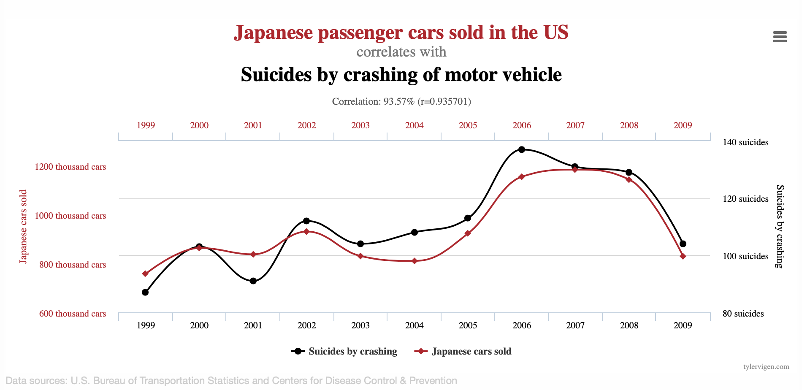
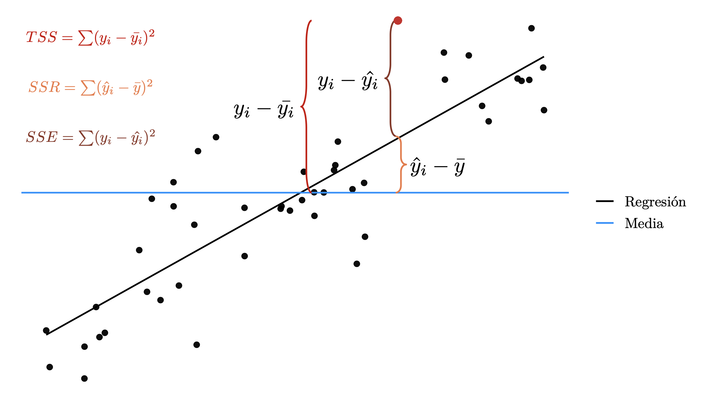
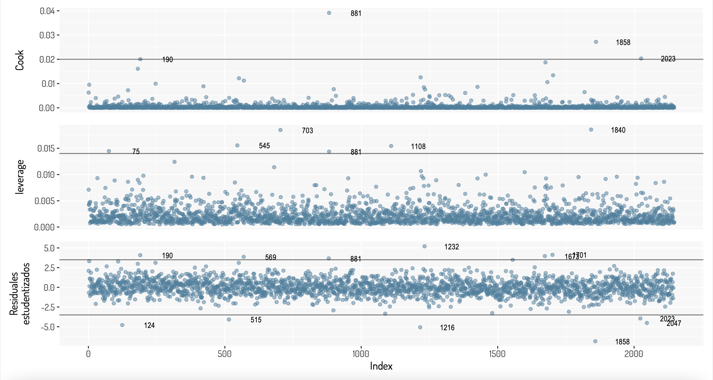

# (PART) Regresión lineal  {-}

# Regresión lineal simple

```{css, echo=FALSE}
pre {
  max-height: 300px;
  overflow-y: auto;
}

pre[class] {
  max-height: 300px;
}
```


**NOTA**: Este trabajo es una continuación directa del trabajo _Statistical Notes_ que se puede encontrar en el siguiente [enlace](https://rpubs.com/CarlosFVG/734736)

Nuestro objetivo en un modelo de regresión será ajustar o asociar una variable, a la que llamaremos variable __respuesta__ o __dependediente__, con una o más variables distintas llamadas variables __predictoras__ o __independientes__, con el fin de poder predecir valores futuros de la variable respuesta y analizar los efectos que tendría esta variable con alteraciones en el resto de variables del modelo.

En este caso, el de la regresión __lineal simple__ consideramos dos variables (1 predictora ($x$) y otra como respuesta ($y$)) y establecemos este modelo de la siguiente manera:

$$
y_{i}=\beta_{0}+\beta_{1}x_{i}+\epsilon_{i}
$$

Por algunas propiedades interesantes, podemos ver que $\mathbf{E}[y_{i}]=\beta_{0}+\beta_{1}x_{i}$ por lo que este modelo considera que la media de $y$ cambia a razón constante mediante los cambios de $x$. Como estamos obteniendo una recta, $\beta_{1}$ es la pendiente de dicha recta y es lo que nos indica la importancia de $x$ sobre $y$ (que tan drásticos son los cambios de una sobre otra). 

$\beta_0$ nos indica el valor de $y$ cuando la variable predictora esta ausente. $\epsilon$ es simplemente un error aleatorio que nos dará ciertos problemas para la validación de este modelo mediante pruebas de hipótesis pero nos otorga la flexibilidad probabilística para la predicción.

Es sencillo realizar una regresión lineal en R, simplemente podemos utilizar el comando `base::lm()` agregando una fórmula (`~`) como parámetro. Por ejemplo, consideremos la base de datos `datasets::cars` donde se tiene la velocidad y la distancia que recorrió un coche para detenerse; estos datos fueron recolectados en 1920.

```{r}
cars %>% ggplot(aes(x = speed, y = dist)) + labs(x = "Velocidad", y = "Distancia") + geom_point(colour = "purple3") + general_theme
```

Ahora, realizaremos nuestro modelo lineal simple:

```{r}
car_regression <- lm(dist~speed, data = cars)
summary(car_regression)
```

Véase que se nos da mucha información:

+ Estadísticas sobre los residuales.
+ Información sobre los coeficientes de la regresión mediante mínimos cuadrados.
+ Información sobre el ajuste del modelo con los datos.

Estos puntos se verán después, algunos de ellos se verán hasta regresión lineal múltiple ya que tienen una interpretación similar, pero por el momento basta con saber que, de acuerdo a los datos obtenidos, nuestro modelo queda expresado de la siguiente manera:

$$
y_i = -17.5791 + 3.9324x_i
$$

Que es lo mismo al siguiente modelo:

$$
\mbox{Distancia del auto }i = -17.5791 + 3.9324\times\mbox{Velocidad del auto }i
$$

Y ahora podemos generar la siguiente gráfica

```{r}
cars %>% ggplot(aes(x = speed, y = dist)) + 
  labs(x = "Velocidad", y = "Distancia") + general_theme +
  geom_point(colour = "purple3") + 
  geom_abline(intercept = car_regression$coefficients[1], 
              slope = car_regression$coefficients[2],
              colour = "red")
```

Hay cosas importantes que ver en este tema y aquí se comenzará con un pequeño análisis de correlación.

## Correlación y linearidad

La manera más sencilla de proponer un conjunto de variables predictoras es ver la relación lineal que tienen estas con la variable respuesta. Esto lo podemos obtener mediante diferentes estadísticas, por ejemplo:

+ Coeficiente de correlación de pearson: $\rho_{xy} = r_{xy} = \frac{\sum_{i = 1}^n(x_i-\bar{x})(y_i-\bar{y})}{\sqrt{\sum_{i = 1^n}(x_i-\bar{x})^2}\sqrt{\sum_{i = 1}^n(y_i-\bar{y})^2}}$
+ Coeficiente de correlación de spearman: $r_s = 1- \frac{6\sum d_i^2}{n(n^2-1)}$ donde $d_i = rango(X_i)-rango(Y_i)$
+ Coeficiente de correlación de Kendall: $\tau = \frac{(\mbox{número de pares concordantes})-(\mbox{número de pares discordantes})}{n \choose 2}$

Cada uno de las estadísticas anteriores tiene un propósito diferente, $\rho$ mide la relación lineal entre las variables que se están comparando, el coeficiente de correlación de spearman mide relaciones monótonas (una relación lineal lo es) y el coeficiente de Kendall mide la semejanza en el ordenamiento de los datos cuando se clasifican en rangos por cada una de las cantidades. Todas estas se pueden obtener mediante la función `base::cor(x, y, method = c("pearson", "kendall", "spearman"))`.

Es importante no sólo considerar el primero de los coeficientes de correlación mencionados, ya que puede existir una clara relación entre las variables (como en un conjunto de puntos que dibujen una parábola) y el coeficiente tener un valor de 0. Vamos a tomar los datos `dplyr::starwars` donde se tienen datos descriptivos de los personajes de la saga Star Wars.

```{r}
starwars
```

Sólo para estos fines, eliminaremos un outlier sobre el peso y consideraremos sólo esta y la altura para ver si existe algún tipo de relación entre estas variables.

```{r, class.output = "scroll-300"}
new_starwars <- starwars %>% filter(mass < max(starwars$mass, na.rm = T))

pearson_star <- cor(new_starwars$height, new_starwars$mass)
spearman_star <- cor(new_starwars$height, new_starwars$mass, method = "spearman")
kendall_star <- cor(new_starwars$height, new_starwars$mass, method = "kendall")

new_starwars %>% ggplot(aes(x = height, y = mass)) + 
  geom_point(color = "royalblue4") + labs(x = "Altura (cm)", y = "Peso (kg)") +
  annotate("text", x = 100, y = 150, label = paste("Pearson: ", pearson_star, collapse = "")) +
  annotate("text", x = 100, y = 140, label = paste("Spearman: ", spearman_star, collapse = "")) +
  annotate("text", x = 100, y = 130, label = paste("Kendall: ", kendall_star, collapse = "")) +
  general_theme
```

Como vemos, el coeficiente de correlación de pearson tiene un valor cercano al de Spearman, aunque este último nos inidica que existe una relación monótona, por lo que podríamos aplicar una transformación para otorgar un comportamiento más cercano al lineal con una función monóntona como lo es el logaritmo.

```{r, class.output = "scroll-300"}
pearson_star <- cor(new_starwars$height, log(new_starwars$mass))
spearman_star <- cor(new_starwars$height, log(new_starwars$mass), method = "spearman")
kendall_star <- cor(new_starwars$height, log(new_starwars$mass), method = "kendall")

new_starwars %>% ggplot(aes(x = height, y = log(mass))) + 
  geom_point(color = "royalblue4") + labs(x = "Altura (cm)", y = "Peso (kg)") +
  annotate("text", x = 100, y = 4.8, label = paste("Pearson: ", pearson_star, collapse = "")) +
  annotate("text", x = 100, y = 4.6, label = paste("Spearman: ", spearman_star, collapse = "")) +
  annotate("text", x = 100, y = 4.4, label = paste("Kendall: ", kendall_star, collapse = "")) +
  general_theme
```

Nuestro coeficiente de correlación lineal aumente significativamente y surge la siguiente pregunta: ¿Cuándo utilizar alguna transformación y cuál? En general, cualquier función que sólo cambie la escala y este definida para los datos que se estén considerando se puede utilizar, como un logaritmo (que nos ayuda a reducir dispersión y dar valores pequeños), una raíz cuadrada, una función inversa, etc; aunque hay que tener cuidado. Por ejemplo ¿Qué pasaría con si tengo valores iguales a cero y aplico un logaritmo? ¿La interpretación sobre los coeficientes cambiaría o no? Este último punto se verá después.

+ Se recomienda revisar el libro The Statistical Sleuth, tercera edición donde se muestran algunos patrones comunes que podrían impedir realizar alguna relación lineal entre variables.

Ahora, si bien es razonable pensar que la altura y el peso estén relacionados de manera lineal ¿Podemos confiar siempre en el resultado de una correlación? No, ya que una correlación no implica causalidad (una relación verdadera entre dos variables). Veamos los siguientes ejemplos del siguiente [enlace](https://www.tylervigen.com/spurious-correlations):

<!--  -->

<center>

</center>

<!--  -->

<center>

</center>

Es difícil pensar que realmente existe una relación entre dichas variables en cada caso, así como considerar que existe una relación entre [la cantidad de IPhones comprados y la cantidad de personas que mueren al caer de las escaleras](https://hbr.org/2015/06/beware-spurious-correlations) o pensar que [la cantidad de cigueñas esta relacionado con la cantidad de nacimientos en Europa](https://priceonomics.com/do-storks-deliver-babies/) aunque se tenga un $r = 0.62$ y un $p-value = 0.008$ en la prueba de hipótesis correspondiente a $\beta_i$.

Otro punto interesante es, ¿Qué tanto podemos confiar sólo en nuestras estadísticas? Consideremos la siguiente información obtenida del paquete `datasauRus`.

```{r}
library(datasauRus)
dino_data <- datasauRus::datasaurus_dozen %>% filter(dataset == "dino")
  datasaurus_dozen %>% 
    group_by(dataset) %>% 
    summarize(
      mean_x    = mean(x),
      mean_y    = mean(y),
      std_dev_x = sd(x),
      std_dev_y = sd(y),
      corr_x_y  = cor(x, y)
    )
```

Como vemos, las estadísticas son bastante similares entre todos los conjuntos de datos, incluso la correlación; por lo que tal vez pensaríamos en tener datos similares; bueno veámos como se ven algunos de estos datos.

```{r}
ggplot(datasaurus_dozen %>% filter(dataset %in% c("dino", "star", "h_lines")), aes(x=x, y=y, colour=dataset))+
  geom_point()+
  theme_void()+
  theme(legend.position = "none")+
  general_theme+
  facet_wrap(~dataset, ncol=3)
```

Aquí se dejan algunos enlaces sobre estos ejemplos en particular:

+ [The Datasaurus data package](https://cran.r-project.org/web/packages/datasauRus/vignettes/Datasaurus.html)
+ [Download the Datasaurus: Never trust summary statistics alone; always visualize your data](http://www.thefunctionalart.com/2016/08/download-datasaurus-never-trust-summary.html)
+ [Same Stats, Different Graphs](https://damassets.autodesk.net/content/dam/autodesk/www/autodesk-reasearch/Publications/pdf/same-stats-different-graphs.pdf)
+ [ShinySaurus](https://rpodcast.shinyapps.io/shinysaurus/_w_2bd1dff9/)

Y algunos con temas relacionados a la correlación:

+ [Correlation](https://en.wikipedia.org/wiki/Correlation)
+ [Pearson correlation coefficient](https://en.wikipedia.org/wiki/Pearson_correlation_coefficient)
+ [Coeficiente de correlación de rango de Kendall](https://es.wikipedia.org/wiki/Coeficiente_de_correlación_de_rango_de_Kendall)
+ [Tau de Kendall](https://economipedia.com/definiciones/tau-de-kendall-i.html)
+ [Spearman's rank correlation coefficient](https://en.wikipedia.org/wiki/Spearman%27s_rank_correlation_coefficient)
+ [Coefficient of colligation](https://en.wikipedia.org/wiki/Coefficient_of_colligation)
[A comparison of correlation measures](https://m-clark.github.io/docs/CorrelationComparison.pdf)

## Variables categóricas

Se puede trabajar con variables categóricas en un modelo de regresión para determinar la importante que tiene una cierta segregación en nuestra variable a modelar. Si bien se podría remplazar todos los valores categóricos por valores numéricos, esto nos ayudaría sólo con valores ordinales. Otra técnica común es la creación de variables [_dummys_](https://en.wikipedia.org/wiki/Dummy_variable_(statistics)) a lo cual se le conoce como [One-Hot-Encoding](https://machinelearningmastery.com/why-one-hot-encode-data-in-machine-learning/).

Para esta sección se utilizarán algunas variables de los tabulados de la encuesta [Encuesta Nacional de Ingresos y Gastos de los Hogares (ENIGH). 2018 Nueva serie](https://www.inegi.org.mx/programas/enigh/nc/2018/#Microdatos), específicamente para el estado de Aguascalientes. Nos interesan ciertas variables que se puedan relacionar con el ingreso corriente de los hogares de dicha región y en esta sección nos interesa determinar la importancia del sexo de los jefes del hogar.

```{r echo=FALSE}
data <- read_xlsx("Ingreso_Gasto2018_(Aguascalientes).xlsx")
data_income_sexo <- data %>% dplyr::select(-c(entidad, paq_turist)) %>% 
  mutate(sexo_jefe = if_else(sexo_jefe == 1, "Hombre", "Mujer"),
         sexo_jefe = factor(sexo_jefe))
data_income_sexo 
```

Vamos a aplicar una regresión lineal entre el ingreso corriente y el sexo del jefe de familia para ver como se comporta la función `lm()`.

```{r}
data_income_sexo  %>% lm(ing_cor~sexo_jefe, .) %>% tidy()
```

Al parecer trabaja bien dicha función con datos categóricos. Lo que sucedio es que tal función realizo una codificación sobre el factor `sexo_jefe`, de hecho aplico esta configuración

```{r}
contrasts(data_income_sexo$sexo_jefe)
```

Es decir, la variable dummy que se esta considerando en el modelo tiene la siguiente codificación:

+ 1 si una persona es mujer
+ 0 si una persona es hombre

Lo que otorgaría una ponderación sobre las variables del modelo cuando estos son diferentes de cero:

+ $\beta_0 + \beta_1$ si una persona es mujer.
+ $\beta_0$ si una persona es hombre.

Estos pueden ser interpretados de la siguiente manera:

$\beta_0 = 60071.50$ es el promedio del ingreso entre los hombres.
$\beta_0 + \beta_1 = 60071.50 - 9822.53 = 50248.97$ es el promedio del ingreso entre las mujeres
$beta_1 = -9822.53$ es el la diferencia promedio en el ingreso entre los hombres y mujeres

El coeficiente negativo para las mujeres en la regresión sólo indica que la categoría "mujer" está asociado con una disminución en el salario (en relación con los hombres).

Si cambiamos la configuración de la variable dummy, la interpretación y los valores "se conservan"

```{r}
di_nc <- data_income_sexo %>%
  mutate(sexo_jefe = relevel(sexo_jefe, ref = "Mujer"))
contrasts(di_nc$sexo_jefe)
```

Véase que el ingreso promedio entre las mujeres sigue siendo 50248.97 y la diferencia promedio en el ingreso entre los hombres y mujeres sigue siendo de 9822.53 pesos, aunque al tomar a los hombres como el factor con valor 1, indica un aumento en la variable respuesta.

```{r}
di_nc %>% lm(ing_cor~sexo_jefe, .) %>% tidy()
```

+ [R Companion to Real Econometrics: Chapter 7 Dummy Variables: Smarter than You Think](https://bookdown.org/carillitony/bailey/chp6.html)

## Paquetes y funciones útiles 

### Correlación

Al utilizar la función `cor()` con un conjunto de datos numéricos obtenemos una matriz de correlaciones entre las distintas variables; esta representación no es la mejor ayuda visual para identificar correlaciones fuertes, por lo que podemos utilizar un correlograma con dicha matriz. Vamos a tomar los datos de gasto-ingreso vistos anteriormente poniendo especial atención sobre el ingreso corriente de los hogares de dicha región.

Aquí se ve una aplicación de la función `corrplot::corrplot()`

```{r include=FALSE}
data_income <- data %>% dplyr::select(-c(entidad, sexo_jefe, paq_turist))
```


```{r}
library(corrplot)
corrplot(cor(data_income), type = "lower", diag = F)
```

Tenemos otras alternativas que nos permiten tener un comportamiento similar al paquete ggplot, como lo es la función `ggcorrplot::ggcorrplot()`.

```{r}
library(ggcorrplot)
ggcorrplot(cor(data_income), 
           #method = "circle"  #Método de visualización, "square" por default.
           hc.order = TRUE, #Orden jerárquico sobre los valores obtenidos.
           outline.col = "white", #Color del margen de los cuadrádos o círculos.
           type = "lower" #Elementos a desplegar en la gráfica
           #lab = TRUE # Anotaciones de los valores obtenidos en cada celda de la matriz.
           #colors = c("green", "black", "red") #Colores 
           )
```

Además de un correlograma, podemos obtener las correlaciones más importantes en otro tipo de gráfico, esto es lo que hace el paquete `lares` con las funciones `corr_cross()` y `corr_var()`. Para más información se sugiere revisar el siguiente [post](https://datascienceplus.com/find-insights-with-ranked-cross-correlations/)

```{r}
library(lares)

corr_cross(data_income,
  max_pvalue = 0.05,  # Correlaciones significantes a mostrar (a un nivel del 5%)
  top = 10            # Cantidad de variables a mostrar con mayor significancia
) + 
  
corr_var(data_income,         
  ing_cor,                    # Nombre de la variable a comparar
  top = 5                  # Cantidad de variables a mostrar con mayor significancia
) 
```

Igual podríamos elegir una visualización más tradicional pero con un formato más elegante, como el proporcionado con la función `modelsummary::datasummary_correlation()`

```{r}
library(modelsummary)
datasummary_correlation(data_income, 
                        method = "pearspear" # "pearson", "kendall", "spearman", or "pearspear" (Pearson correlations above and Spearman correlations below the diagonal)
                        ) %>% 
  kable_styling(bootstrap_options = "striped", full_width = F) %>%
  scroll_box(width = "100%")
```

+ [ggcorr::correlation matrixes with ggplot2](https://briatte.github.io/ggcorr/)

### Regresión

+ Con ggplot podemos añadir de manera rápida una recta de regresión a nuestros datos; véase como se hace uso de la base de datos de las olimpiadas y de la función `ggplot::geom_smooth()` para agregar una capa con la recta de regresión.

```{r}
olympics <- read_csv("athlete_events.csv") %>% distinct()
olympics %>% filter(!is.na(Medal) & !is.na(Age)) %>% 
  filter(!(Year %in% c(1994, 1998, 2002, 2006, 2010, 2014))) %>% #Eliminamos algunos valores inluyentes
  group_by(Year) %>%
  count(Medal) %>% 
  ggplot(aes(x = Year, y = n)) + 
  geom_point() + 
  general_theme + 
  geom_smooth(formula = y~x, method = "lm") +
  labs(x = "Año", y = "Cantidad de medallas")
```


### TidyModels::Broom

```{r}
library(broom)
glance(car_regression)
tidy(car_regression)
```


## Ejemplo

Consideremos la base de datos de la encuesta ingreso-gasto del 2018 en Aguascalientes. 

```{css, echo=FALSE}
.main-container {
    max-width: 300px !important;
}
```

```{r, class.output = "scroll-300"}
library(skimr)
fancy_summary <- skim_with(
  numeric = sfl(
    Min = min,
    Max = max,
    #Q1 = ~ quantile(., probs = .25),
    Median = ~quantile(., probs = .50),
    #Q3 = ~ quantile(., probs = .75),
    Mean = mean,
    Sd = sd,
    hist = ~ inline_hist(., 5)
  ),
  append = FALSE
)
fancy_summary(data_income)
```


Aquí consideramos un modelo lineal por cada variable y mostramos el resultado de la regresión entre el ingreso y la edad del jefe de familia.

```{r}
all_linear_models <- data_income %>% 
  dplyr::select(-ing_cor)  %>% map(~summary(lm(data_income$ing_cor~.x)))
all_linear_models$edad_jefe
```

Para comparar los distintos modelos, podemos hacerlo bajo diferentes criterios; por ejemplo con el $R^2$

```{r}
all_linear_models %>% map_df(~`[[`(.x, "r.squared")) %>% 
  gather("Variable predictora", "r", 1:13) %>% arrange(desc(r))
```

O por el p-value de la variable independiente

```{r}
all_linear_models_tidy <- data_income %>% 
  dplyr::select(-ing_cor) %>% map(~tidy(lm(data_income$ing_cor~.x)))
all_linear_models_tidy %>% map_df(~.x[2,"p.value"]) %>% 
  mutate("Variable predictora" = names(all_linear_models_tidy)) %>% 
  dplyr::select("Variable predictora", "p.value") %>% arrange(p.value)
```
...
...

Finalmente, aquí se dejan más enlaces útiles

+ [The Discovery of Statistical Regression](https://priceonomics.com/the-discovery-of-statistical-regression/)
+ [Shiny: Sum of Squares](https://paternogbc.shinyapps.io/SS_regression/)
+ [Ordinary Least Squares Regression](https://setosa.io/ev/ordinary-least-squares-regression/)
+ [Correlación no implica causalidad](https://www.jotdown.es/2016/06/correlacion-no-implica-causalidad/)
+ [How to apply and interpret linear regression in R](https://datatricks.co.uk/how-to-apply-and-interpret-linear-regression-in-r)

## Otros puntos importantes

Hasta este momento sólo se ha construido un modelo de manera sencilla sin haber considerado factores importantes como la validación de supuestos (lo cual determinará si nuestro modelo tiene veracidad o no), el uso de otro tipo de transformaciones, la comparación de modelos, etc. Todo lo antes mencionado se verá en la regresión múltiple ya que es completamente equivante el enfoque.

<!-- ### $r^2$ vs $R^2$ -->

```{r, echo=FALSE}
# cars %>% ggplot(aes(x = speed, y = dist)) + 
#   labs(x = "Velocidad", y = "Distancia") + general_theme +
#   geom_point(aes(color = "Observaciones")) + 
#   geom_abline(color = "dodgerblue4", 
#               aes(linetype = "best fit"),
#               intercept = car_regression$coefficients[1], 
#               slope = car_regression$coefficients[2]) +
#   scale_color_manual(values = "cornflowerblue", name = "Observaciones") + 
#   scale_linetype_manual(name = "Regresión", values = "solid")
```


# Regresión lineal múltiple

```{css, echo=FALSE}
pre {
  max-height: 300px;
  overflow-y: auto;
}

pre[class] {
  max-height: 300px;
}
```

El mundo es complejo y aveces tratar de modelar el comportamiento de un evento sólo por una variable no es lo más conveniente; así que el camino natural para mejorar nuestro modelo de regresión simple es hacer múltiple agregando más variables. Así ya no estaríamos trabajando, geométricamente hablando, en una recta, si no en un hiperplano.Entonces, suponiendo $p$ predictores, una regresión múltiple queda expresada matematicamente como sigue:

$$
f(X) = Y = \beta_0 +\beta_1X_1+\beta_2X_2+\dots + \beta_pX_p+\epsilon = \beta_0 + \sum_{i = 1}^pX_i\beta_i + \epsilon = X\beta + \epsilon
$$


Donde $\beta_i$ son los parámetros del modelo representando el efecto promedio en $Y$ de un incremento de una unidad en $X_i$, **manteniendo todos los otros predictores fijos** y $\epsilon\sim N(0,\sigma^2)$.

De igual manera, la forma habitual de estimar los parámetros es mediante el uso de mínimos cuadrados para minimizar la suma de los residuales al cuadrado:

$$
RSS = \sum_{i = 1}^n(y_i-f(x_i))^2 = \sum_{i = 1}^n(y_i-\hat y_i)^2 = \sum_{i = 1}^n(y_i-\hat\beta_0-\hat\beta_1x_{i1}-\hat\beta_2x_{i2}-\cdots-\hat\beta_px_{ip})^2 = \sum_{i = 1}^n\left(y_i-\beta_0-\sum_{j = 1}^px_{ij}\beta_j\right)^2
$$

Vamos a seguir tomando el ejemplo de los ingresos en el estado de Aguascalientes de acuerdo a la [Encuesta Nacional de Ingresos y Gastos de los Hogares (ENIGH). 2018 Nueva serie](https://www.inegi.org.mx/programas/enigh/nc/2018/#Microdatos). Vamos a ajustar un modelo con las variables que tengan la mejor correlación con el ingreso eliminando previamente algunos outliers que se consiguen en ciertas variables.

Para facilitarnos esto, veamos el siguiente gráfico de correlación con la correlación de spearman para ver relaciones monotonas y después diagramas de dispersión junto a la correlación de pearson que se consigue por pares.

```{r, class.output = "scroll-300"}
(data_income %>% filter(ing_cor < 2000000 & transporte < 350000 & limpieza < 40000 & personales < 113246) %>% 
  cor(method = "spearman") %>% 
  ggcorrplot::ggcorrplot(hc.order = TRUE, outline.col = "white", type = "lower", 
                         tl.cex = 8#, lab = T
                         )+
   general_theme + 
  theme(legend.text = element_text(size = 8, face = "plain"), 
        legend.title = element_text(size = 8, face = "plain"), 
        legend.position = c(0.30, 0.85),
        legend.direction = "horizontal",
        legend.box = "horizontal",
        panel.background = element_blank())) + 
(data_income %>% filter(ing_cor < 2000000 & transporte < 350000 & limpieza < 40000 & personales < 113246) %>%
   dplyr::select(ing_cor, transporte, alimentos, limpieza, personales) %>%
   GGally::ggscatmat() + 
   general_theme + 
   theme(axis.text = element_text(size = 8), 
         axis.text.x = element_text(angle = 45)))
```

Por lo que proponemos distintas transformaciones; el resultado de esto lo podemos ver en la siguiente matriz de dispersión

```{r}
data_income %>% filter(ing_cor < 2000000 & transporte < 350000 & limpieza < 40000 & personales < 113246) %>%
  dplyr::select(ing_cor, transporte, alimentos, limpieza, personales) %>% 
  mutate(ing_cor = log(ing_cor),
         transporte = sqrt(transporte),
         alimentos = sqrt(alimentos),
         limpieza = sqrt(limpieza),
         personales = sqrt(personales)) %>% 
  GGally::ggscatmat() + general_theme
```


Entonces, ajustando un modelo de regresión con los siguientes datos obtenemos el siguiente modelo junto con la implementación de dicho modelo en R:

```{r}
mutated_data_income <- data_income %>% filter(ing_cor < 2000000 & transporte < 350000 & limpieza < 40000 & personales < 113246) 
  #dplyr::select(ing_cor, transporte, alimentos, limpieza, personales) 
#%>% dplyr::select(ing_cor_log, transporte_sqrt, alimentos_sqrt, limpieza_sqrt, personales_sqrt)

first_m_model <- mutated_data_income %>% lm(log(ing_cor)~sqrt(transporte) + sqrt(alimentos) + sqrt(limpieza) + sqrt(personales), data = .)
first_m_model %>% summary()
```

```{r}
library(equatiomatic)
extract_eq(first_m_model)
```

O mejor dicho

$$
\log(ing\_cor) = \alpha + \beta_{1}\sqrt{transporte} + \beta_{2}\sqrt{alimentos} + \beta_{3}\sqrt{limpieza} + \beta_{4}\sqrt{personales} + \epsilon
$$

Como vemos, con todas las variables se rechaza la hipótesis $H_0: \beta_i = 0$, además de que también se rechaza la hipótesis $H_0: \beta_1 = \beta_2 = \beta_3 = \beta_4 = 0$ con la prueba ANOVA y tenemos un $R^2$ ajustado del 0.4781, por lo que el modelo recupera un 47% de la variabilidad de los datos, lo cual no significa que sea un mal modelo. Veamos un poco más a detalle que significa todo esto, además de hacer ver posibles problemas que hagan que nuestro modelo no sea adecuado.

## Pruebas de hipótesis y ANOVA e intervalos

Lo primero que nos otorga el `summary` del modelo anterior es lo siguiente:

```{r}
broom::tidy(first_m_model)
```

Con esto obtenemos:

1. Los coeficientes de nuestro modelo (columna `estimate`)
2. El error estandar sobre para parámetro (columna `std.error`)
3. El estadístico de la prueba sobre los coeficientes (columna `statistic`)
4. El $p-value$ sobre la prueba mencionada en el anterior punto (columna `p.value`)

Hay que recordar que el error estandar nos ayuda a crear los intervalos de confianza sobre cada parámetro del modelo. Tomemos como ejemplo el termino $\beta_1$ asociado a la raíz cuadrada del gasto en transporte. El intervalo de confianza en este caso sería, **aproximadamente**, el siguiente:

$$
\hat{\beta_i}\pm 2\cdot SE(\hat{\beta_i}) = \left[\hat{\beta_1}-2\cdot SE(\hat{\beta_1}), \hat{\beta_1}+2\cdot SE(\hat{\beta_1})\right] = [0.004755661, 0.005943853]
$$

Lo que significa que, hay aproximadamente un 95% de probabilidad de que el intervalo $[0.004755661, 0.005943853]$ contiene **el verdadero valor de $\beta_1$**. También podríamos haber utilizado el hecho de que suponemos en la construcción de intervalos de confianza que todos los coeficientes se distribuyen de manera normal ($\hat{\beta_i} = N(\beta_i, \sigma^2C_{(i+1)(i+1)})$ donde $C_{(i+1)(i+1)})$ es el i-ésimo coeficiente de la diagonal de la matriz $(X'X)^{-1}$) y haber calculado los intervalos como:

$$
\hat{\beta_i}\pm 1.96\cdot SE(\hat{\beta_i}) = \left[\hat{\beta_1}-2\cdot SE(\hat{\beta_1}), \hat{\beta_1}+1.96\cdot SE(\hat{\beta_1})\right] = [0.004755661, 0.005943853]
$$


Aunque para ser más precisos, los intervalos de confianza, de manera general, están determinados por la siguiente ecuación:

$$
\hat{\beta_i}\pm t_{n-k-1}^{\alpha/2} \sqrt{\hat{\sigma}^2C_{(i+1)(i+1)}}
$$


Para nuestro caso podemos calcularlos de la siguiente manera:

```{r}
sfm <- summary(first_m_model)
interval_confidence_firstM <- matrix(
  c(sfm$coefficients[,1] - qt(0.975, df = sfm$df[2]) * sfm$coefficients[, 2],
  sfm$coefficients[,1] + qt(0.975, df = sfm$df[2]) * sfm$coefficients[, 2]),
  ncol = 2
)
row.names(interval_confidence_firstM) <- row.names(sfm$coefficients)
colnames(interval_confidence_firstM) <- c("lower", "upper")
interval_confidence_firstM
```

Los cuales se pudieron haber obtenido con la función `stats::confint.lm()`

```{r}
confint(first_m_model)
```

Una manera elegante que podemos utilizar para visualizar la anterior información no las proporciona la función `modelsummary::modelplot()`

```{r, fig.height=3, fig.width=8}
modelplot(first_m_model) +  general_theme + theme(panel.background = element_blank())
```

Por la escala que tenemos en nuestro intercepto, tenemos poca apreciación del resto de coeficientes

```{r, fig.height=3, fig.width=8}
modelplot(first_m_model, coef_omit = "Intercept") + general_theme + theme(panel.background = element_blank())
```

Retomando el ejemplo, podemos decir que en la ausencia de cualquiera de nuestras variables, el ingreso, en promedio, estará entre \$10652.86 (=exp(9.273583316)) y 12226.41 pesos mexicanos. Y, por ejemplo, con un aumento de \$1,000 pesos en el gasto de alimentos, el ingreso debe aumentar, en promedio para los ciudadanos de Aguascalientes, entre \$1000.018 y \$1000.033 pesos mexicanos.

Respecto a los valores obtenidos en la columna `statistic`, estos corresponden a un  estadístico $t$ para determinar si hay una relación entre la variable asociada a dicho parámetro y la variable a predecir. Para tales fines nuestro estadístico mide el número de desviaciones estandar que nuestro coeficientes lejanas desde el 0, es decir:

$$
t = \frac{\hat{\beta_i}-0}{SE(\hat{\beta_i})}
$$

Y la prueba de hipótesis en la que se utiliza dicho estadístico queda determinada de la siguiente manera:

$$
\begin{array}{c}
H_0: \mbox{No hay alguna relación entre }X \mbox{ y }Y \equiv \beta_i = 0\\
H_a: \mbox{Hay alguna relación entre }X \mbox{ y }Y \equiv \beta_i \neq 0
\end{array}
$$

Entonces lo que buscamos es que $\hat{\beta_i}$ este lo más alejado del 0, es decir que si $SE(\hat{\beta_i})$ es pequeño, $\hat{\beta_i}$ puede ser pequeño y si $SE(hat{\beta_i})$ es grande, entonces $\hat{\beta_i}$ debe ser lo suficientemente grande en valor absoluto. En la siguiente gráfica podemos ver que todas nuestras variables son relevantes para modelar el ingreso (gracias a que los $p-values$ indican de la información no es compatible con la hipótesis nula), así como una comparación entre los valores de cada uno de los coeficientes.

```{r}
GGally::ggcoef_model(first_m_model) + general_theme
```

Por lo que, al considerar que la raíz cuadrada es una función monótona y creciente, al igual que el logaritmo en el rango que estamos considerando ($\mathbb{R^{+}}$), los cambios en los gastos personales, en promedio, son lo que más puede afectar en el ingreso si los demás gastos permanecen constantes; de hecho por cada \$1,000 más en los gastos personales, se necesitará entre \$1000.018 y \$1000.043 pesos mexicanos que aumente el ingreso.

Lo último que se visualiza en un `summary` de un modelo lineal son algunas estadísticas sobre el rendimiento del modelo e información sobre la prueba ANOVA, por el momento sólo se analizará esto último.

```{r}
glance(first_m_model) %>% dplyr::select(statistic, p.value, df)
```

La prueba **ANOVA** ([Análisis de Varianza](https://en.wikipedia.org/wiki/Analysis_of_variance#Textbook_analysis_using_a_normal_distribution)) es un prueba que nos ayudará a determinar la significancia del modelo, es decir que se desea probar si la ecuación de regresión no explica una proporción considerable de la variabilidad en la variable respuesta, contra la hipótesis alternativa de que sí la explica, es decir:

$$
\begin{array}{c}
H_0 : \beta_1 = \beta_2 = \cdots = \beta_p = 0\\
vs\\
H_1 : \beta_i \neq 0 \mbox{ p.a }i, i\in\{1,2,\dots, p\}
\end{array}
$$

El estadístico para esta prueba hace entender el nombre de la prueba y para obtenerlo necesitamos diferentes estadísticas. De acuerdo a la bibliografía se pueden encontrar diferentes nomenclaturas, aquí se colocan algunas ejemplos:

<!-- $TSS = \sum(y_i-\bar{y_i})^2$ : Total sum of squares -->
<!-- $RSS = \sum(y_i-\hat{y_i})^2$: Residual sum of squares -->

<!-- $SC_T = \sum(y_i-\bar{y_i})^2$ : Suma de cuadrados total -->
<!-- $SC_{reg} = \sum(\hat{y}_i-\bar{y})^2$: Suma de cuadrados de la regresión -->
<!-- $SC_{error} = \sum(y_i-\hat{y_i})^2$: Suma de cuadrados del error -->

<!-- $SSM = \sum(\hat{y}_i-\bar{y})^2$: Sum of Squares of the model -->
<!-- $SSE = \sum(y_i-\hat{y_i})^2$: Sum of Squares of the error -->

<!-- $CM_{reg} = SC_{reg}/p$: Cuadrado medio de la regresión -->
<!-- $CM_{error} = SC_{error}/n-p-1$: Cuadrado medio del error -->

<!-- $MSM = SSM/p$: Mean Square of Model -->
<!-- $MSE = SSE/n-p-1$: Mean Square of error -->

<!-- $F = \frac{CM_{reg}}{CM_{error}}$ -->
<!-- $F = \frac{MSM}{MSE}$ -->

+ $TSS = SC_{total} = \sum(y_i-\bar{y_i})^2$: Total sum of squares o la suma de cuadrados total.
+ $SC_{reg} = SSM = SSR = \sum(\hat{y}_i-\bar{y})^2$: La suma de cuadrados de la regresión o del modelo.
+ $RSS = SC_{error} = SSE = \sum(y_i-\hat{y_i})^2$: La suma de cuadrados del error o de los residuales

La segunda estadística la podemos interpretar como la cantidad de varianza explicada por la regresión, por el modelo o por las variables; mientras la tercera se puede interpretar como la cantidad de varianza que no se explica por la regresión.

+ $CM_{reg} = SC_{reg}/p; MSM = MSR = SSM/p$: Cuadrado medio de la regresión o Mean Square of model/regression
+ $CM_{error} = SC_{error}/n-p-1; MSE = SSE/n-p-1$: Cuadrado medio del error

Y con esto ya podemos obtener nuestro estadístico $F$:

+ $F = \frac{CM_{reg}}{CM_{error}}$
+ $F = \frac{MSM}{MSE}$

$$
F = \frac{MSR}{MSE} = \frac{CM_{reg}}{CM_{error}} = \frac{(TSS-RSS)/p}{RSS/(n-p-1)}
$$

Este estadístico tiene una distribución $F_{p, n-p-1}$ y rechazaremos la hipótesis nula cuando $F>F^{(\alpha)}_{k, n-k-1}$. Si los supuestos del modelo de regresión lineal son validos, se puede ver que $\mathbb{E}[RSS/(n-p-1)] = \sigma^2$, es decir la $\sigma^2$ estimada para todo el modelo, y bajo la hipótesis nula $\mathbb{E}[(TSS-RSS)/p] = \sigma^2$. Por lo que cuando NO hay relación entre la variable dependiente y los predictores, se esperaría que el estadístico $F$ sea cercano a 1.

Si $H_a$ es cierta $\mathbb{E}[(TSS-RSS)/p] > \sigma^2$, por lo que tendríamos valores más grandes que 1 en el estadístico.

Entonces podemos interpretar este estadístico como la razón entre la variabilidad explicada por los regresores entre la variabilidad no explicada por el modelo, ponderando con los respectivos grados de libertad que contiene cada estadístico. Por lo que buscamos que nuestro modelo contenga la mayor cantidad de información proporcionada por los datos. Sólo para aclarar, $TSS-RSS = SC_{total}-SC_{error} = SC_{reg}$ y esto es gracias a la siguiente igualdad

$$
SC_{total} = SC_{reg} + SC_{error}
$$
 
La cual proviene de la [ley total de la varianza](https://en.wikipedia.org/wiki/Law_of_total_variance) donde los sumandos igual pueden ser interpretados como la cantidad de varianza explicada y no explicada:

$$
Var(Y) = \mathbb{E}[Var(Y|X)] + Var(\mathbb{E}[Y|X])
$$

Esto puede ser entendido de manera sencilla con la siguiente gráfica

```{r eval=FALSE, include=FALSE}
library(latex2exp)
library(tikzDevice) #Agregar texto con Latex
set.seed(52)
variable_x <- sample(seq(1, 100, by = 0.01), size = 50)
output <- 5 + variable_x*0.1 + 2*rnorm(n = length(variable_x), mean = 0, sd = 1)
tikz(file = "Regression.tex", width = 6.35, height = 3.8)
ggplot(data = tibble(x = variable_x, y = output) %>% filter(x != 64.22) %>% 
         filter(x != 81.54) %>% filter(x != 48.49),
       aes(x = x, y = y))+ 
  geom_point() +
  geom_smooth(aes(color = "1"), method = "lm", se = F) + 
  geom_hline(aes(color = "2", yintercept = mean(output)), size = 1) + 
  white_theme + 
  labs(color = "", y = NULL, x = NULL) + 
  theme(legend.background = element_rect(fill = "white"), legend.key=element_blank()) +
  scale_color_manual(values = c("black", "dodgerblue"), 
                     labels = c("Regresión", "Media")) + 
  geom_brace(aes(c(69,71), c(13.024, 17.64)), inherit.data=F, rotate = 270, size = 1, color = "tomato4") + 
  geom_brace(aes(c(71,73), c(mean(output),13.01)), inherit.data=F, rotate = 90, size = 1, color = "sienna2") + 
  geom_brace(aes(c(53,55), c(mean(output), 17.64)), inherit.data=F, rotate = 270, size = 1, color = "red3") + 
  geom_point(aes(x = 71.42, y = 17.640196), color = "firebrick3", size = 2) + 
  annotate("text", x = 62, y = 15.332, label = "$y_i-\\hat{y_i}$", size = 5) + 
  annotate("text", x = 79, y = 11.88438, label = "$\\hat{y}_i-\\bar{y}$", size = 5) + 
  annotate("text", x = 46, y = 14.19938, label = "$y_i-\\bar{y_i}$", size = 5) + 
  annotate("text", x = 13, y = 17, label = "$TSS  = \\sum(y_i-\\bar{y_i})^2$", size = 3.5, color = "red3") +
  annotate("text", x = 13, y = 15, label = "$SSR = \\sum(\\hat{y}_i-\\bar{y})^2$", size = 3.5, color = "sienna2") +
  annotate("text", x = 13, y = 13, label = "$SSE = \\sum(y_i-\\hat{y_i})^2$", size = 3.5, color = "tomato4")
dev.off()
```

<!--  -->

<center>

</center>

<br></br>

Para resumir la información de dicha prueba tenemos la tabla ANOVA: 

$$
\begin{array}{|c| c| c| c| c|}
\hline
&Grados\ de\ libertad & Suma\ de\ Cuadrados & Cuadrado\ Medio & Prueba\ F \\
\hline
\hline
Regresión & k   & SSR = \hat{\beta}'X'\underline{Y}-n\overline{y}^2 & MSR = \frac{SC_{reg}}{k} & \frac{CM_{reg}}{CM_{error}} \\
\hline
Error     & n-k-1& SSE = \underline{Y}'(I-H)\underline{Y} & MSE = \frac{SC_{error}}{n-k-1} & -\\
\hline 
Total     & n-1 & TSS = \underline{Y}'\underline{Y}-n\overline{y}^2 & - & - \\
\hline
\end{array}
$$

Y en R podemos utilizar la siguiente función con nuestro modelo previamente ajustado

```{r}
anova(first_m_model)
```

```{r, eval=F, echo=T}
m1 <- mutated_data_income %>% lm(ing_cor_log~transporte_sqrt + alimentos_sqrt +limpieza_sqrt + personales_sqrt, data = .)
m2 <-  mutated_data_income %>% lm(ing_cor_log~ alimentos_sqrt +limpieza_sqrt + personales_sqrt, data = .)
anova(m2, m1)
```

Aquí se dejan algunos enlaces que pueden ayudar a aclarar todos los conceptos

+ [Lab notes for Statistics for Social Sciences II: Multivariate Techniques :ANOVA and model fit](https://bookdown.org/egarpor/SSS2-UC3M/multlin-aovfit.html)
+ 

## Interacción y selección de variables

Entre todos los factores que tenemos que considerar en nuestro modelo lineal múltiple, tenemos dos que pueden causar graves problemas: **Aditividad** y **linearidad** entre los predictores y la variable respuesta. El concepto (y supuesto) de Linearidad es claro para este momento (1 cambio en X implica un cambio constante en Y), por otro lado hemos utilizado la aditividad en nuestras interpretaciones de los coeficientes.

La aditividad significa que el efecto que tiene una variable predictora sobre el modelo es independiente de otra regresora sobre la variable respuesta lo cual podría no suceder. Véamos un ejemplo con la misma base de los ingresos en Aguascalientes. Para esto vamos a considerar un modelo más grande, tomando en cuenta las variables de calzado y vestido. Primero veamos la siguiente gráfica en la cual se plasman los datos ya transformados, considerando los filtros anteriores, agregando la significancia de la variable regresora sobre modelos lineales simples

```{r, class.output = "scroll-300"}
m_calzado <- lm(log(ing_cor)~sqrt(calzado) , data = mutated_data_income) %>% summary()
m_vestido <- lm(log(ing_cor)~sqrt(vestido) , data = mutated_data_income) %>% summary()

(mutated_data_income %>%
  ggplot(aes(x = sqrt(calzado), y = log(ing_cor))) +
  geom_point() + geom_smooth(method = "lm") + 
  annotate("text", x = 70, y = 9, family="Dosis",
           label = paste0("p-value: ", m_calzado$coefficients[2,4])) + 
  general_theme) +
(mutated_data_income %>% 
  ggplot(aes(x = sqrt(vestido), y = log(ing_cor))) +
  geom_point() + geom_smooth(method = "lm") + 
  labs(y = NULL) + 
  annotate("text", x = 100, y = 9, family="Dosis",
           label = paste0("p-value: ", m_vestido$coefficients[2,4])) + 
  general_theme)
```

Como vemos, ambas variables variables tiene un p-value muy pequeño para no considerarlas importantes en nuestro modelo, veamos si mejora nuestro modelo con dichas variables y de paso veamos el uso de la función `stats::update()`

```{r}
update(first_m_model, . ~ .+ sqrt(calzado) + sqrt(vestido), data = mutated_data_income) %>% summary()
```

Comparado con el anterior modelo, nuestra $R^2$ ajustada aumento y sigue siendo válida la prueba ANOVA, pero ¿Qué notamos ahora en nuestro modelo?

Al considerar la variable $\sqrt{calzado}$, esta ya no es importante para el modelo de acuerdo a la prueba $H_0: \beta_i = 0$. ¿Esto por qué sucede? 

Al parecer el efecto que tenía la raíz cuadrado del calzado sobre el logaritmo de los ingresos ya no es relevante y esto es porque de alguna manera esta relación queda explicada por la otra variable que agregamos, es decir: $\sqrt{vestido}$. Lo cual tiene sentido ya que si se hace un gasto en el vestido, es muy probable que sea haga un gasto en el calzado y si se hace un gasto en calzado, seguramente los encuestados consideraron esto en la variable vestido. De hecho, veamos que tan correlacionadas están estas variables

```{r, fig.height=3, fig.width=8}
mutated_data_income %>% dplyr::select(vestido, calzado, ing_cor) %>% cor() %>% ggcorrplot(type = "lower", lab = T) + general_theme + 
  theme(legend.text = element_text(size = 8, face = "plain"), 
        legend.title = element_text(size = 8, face = "plain"), 
        legend.direction = "vertical",legend.position = "right",
        panel.background = element_blank())
```

Entoces, al tener que los aumentos en el calzado aumentaran los del vestido y veceversa, esto viola el supuesto de aditividad en el modelo lineal. Para solucionar esto agregamos una **interacción** al modelo con estas variables, es decir que agregaremos el término $\beta_iX_{calzado}X_{vestido}$ al modelo, entonces ahora nuestro modelo sería el siguiente:

$$
\begin{split}
\log(ing\_cor) = & \beta_{0} + \beta_{1}\sqrt{transporte} + \beta_{2}\sqrt{alimentos} + \beta_{3}\sqrt{limpieza} + \beta_{4}\sqrt{personales} + \beta_5\sqrt{calzado} + \beta_6\sqrt{vestido} + \beta_7\sqrt{calzado}\times \sqrt{vestido} + \epsilon\\
& \beta_{0} + \beta_{1}\sqrt{transporte} + \beta_{2}\sqrt{alimentos} + \beta_{3}\sqrt{limpieza} + \beta_{4}\sqrt{personales} + \widetilde{\beta_5}\sqrt{calzado} + \beta_6\sqrt{vestido} + \epsilon
\end{split}
$$

En la última expresión suponemos que $\widetilde{\beta_5} = \beta_5+\beta_7\sqrt{X_{vestido}}$ y así podemos seguir viendo nuestro modelo "sin interacciones", sólo que ahora un cambio en el calzado tendrá un efecto en el vestido y veceversa

Para agregar una interacción entre variables, utilizamos `var1:var2` en la formula. Veamos el `summary` que obtenemos de nuestro nuevo modelo

```{r}
second_m_model <- update(first_m_model, . ~ .+ sqrt(calzado) + sqrt(vestido) + sqrt(calzado):sqrt(vestido),
       data = mutated_data_income) 
second_m_model %>% summary()
```

Es evidente, bajo una significancia del 5% que la ponderación de la interacción es estadísticamente diferente de cero, dándole un peso relevante a nuestro modelo. Con esto podemos decir que por cada \$100 pesos de aumento en el calzado, tendremos un aumento de  $(\beta_5+\beta_7\sqrt{X_{vestido}})\times 10 = (0.001467 + 0.004718\times X_{vestido})\times 10 = 0.01467 + 0.04718\times X_{vestido}$ unidades sobre el logaritmo de los ingresos.

Véase que seguimos viendo que $\sqrt{calzado}$ sigue sin ser relevante.entonces ¿Por qué no consideramos un modelo sin esta variable? 

Para evitar inconsistencias en los modelos, si se realiza una interacción, en el modelo se debe tener presente las variables de la interacción, a esto se le llama **principio jerárquico**, independientemente si el coeficiente de alguna de las variables es estadísticamente 0 o no. ¿Qué pasaría por ejemplo si omitimos el calzado en nuestro modelo? en tal caso, si hay un aumento en calzado pero no hay presencial del gasto en vestido $\beta_7\sqrt{calzado\times vestido} = 0$ cuando debe ser así ya que realmente hubo un aumento en al menos una de las variables. Además de cumplir ahora el supuesto de aditividad, véase que nuestro modelo mejoro en comparación del anterior.

```{r}
second_m_model %>% 
  glance() %>% gather("Estadística", "Nuevo modelo") %>% 
  inner_join(
    first_m_model %>% glance() %>%  gather("Estadística", "Anterior modelo"),
    by = "Estadística"
  )
```

Con este nuevo modelo aumento el $R^2$ ajustada, el $p-value$ de la prueba ANOVA indica que nuestras variables son significativas y las estadísticas AIC y BIC disminuyeron.

La interacción con datos categóricos cambia un poco en el sentido de que puede ser más fácil identificar dichas interacciones.

Considerando el AIC, por ejemplo, podemos utilizar algunas técnicas para elegir el mejor modelo, de acuerdo a una estadística como esta, omitiendo diferentes variables al modelo o agregándolas. Estas técnicas son llamadas __**Forward Selection**__, __**Backward Selection**__ y __**Mixed Selection**__ en los cuales simplemente se comienza con un modelo base y se van agregando o eliminando variables de acuerdo a la significancia que se vaya obteniendo con los coeficientes o con otro criterio como el AIC.

Veamos como aplicarlo a nuestro modelo

```{r}
best_second_model <- second_m_model %>% MASS::stepAIC(direction = "backward")
```

```{r}
summary(best_second_model)
```

En este caso tenemos un bueno modelo ya que algorítmicamente si eliminamos alguna de las variables, perderíamos información con el subsequente modelo (esto mediante el AIC). Sólo para ejemplificar, veáse que pasaría con nuestros datos originales

```{r}
model_zero <- lm(ing_cor~., data = mutated_data_income) %>% stepAIC(direction = "backward")
```

Véase que con todos los datos y sin ninguno tipo de limpieza el AIC determinado por el segundo modelo (se elimino la variable `tot_integ`)  es mejor. Un punto importante que hay que remarcar es que este modelo no significa que sea el mejor que podamos obtener, de hecho nuestro último modelo (`second_model`) es hasta ahora el mejor. 

Por razones que se explorarán posteriormente, vamos a eliminar la interacción y las variables `calzada` y `vestido` ya que el modelo es mejor sin estas variables (es mejor en los supuestos, lo cual nos importará más que obtener el mejor AIC o mejor $R^2$).

## Supuestos y problemas potenciales

Antes de pasar con los supuestos del modelo lineal, véamos un poco más a detalle las transformaciones más comunes para obtener un comportamiento lineal entre nuestros predictores y la variable respuesta.

### +Transformaciones

Hasta el momento se han mencionado algunas transformaciones que nos pueden ayudar a conseguir linealidad entre dos variables, por ejemplo cuando deseamos reducir la variabilidad de la variable a predecir o cambiar la escala de la variable predictora:

<!-- véamos por ejemplo la siguiente gráfica basada en la información proporcionada por el libro [4] -->

```{r echo=FALSE}
# set.seed(21)
# x <- sample(seq(1,30, by = 0.01), size = 120)
# data_several <- tibble(x = x,
#        y_good = 5 * x + 4 + 20*rnorm(length(x), mean = 0, sd = 1),
#        y_Tx = sqrt(y_good))
# 
# data_several %>% ggplot(aes(x = sqrt(x) , y =y_good)) + geom_point()
# 
# x <-  c(sample(seq(1,10, by = 0.01), size = 130), sample(seq(10,30, by = 0.01), size = 20))
# data_several %>% mutate(x = x) %>% mutate(y = sqrt(x) + rnorm(length(x>0), mean = 0, sd = 1)) %>% 
#   ggplot(aes(x= x, y = y)) + geom_point() + lims(y = c(0,10))
# 
# ggplot(data = tibble(x = x, y = 5 * x + 4 + 20*rnorm(length(x), mean = 0, sd = 1)), 
#        aes(x = x, y = y))+ 
#   geom_point() +
#   geom_smooth(color = "red", se = F) + 
#   white_theme + 
#   labs(color = "", y = NULL, x = NULL)
```

+ $log()$: Función monótona creciente definida para los positivos e indefinida para el 0.
+ $sqrt()$: Función monótona creciente definida para los positivos y el 0.
+ $1/x$: Función monótona creciente definida para los positivos e indefinida para el 0.

De acuerdo al comportamiento de los datos podemos aplicar cualquiera de estas variables siempre que este bien definida la función. ¿Qué podemos hacer cuando tenemos ceros? ¿Qué otras propuestas comunes existen?

Para el primer punto hay que pensar que los ceros pueden tener diferentes significados en nuestras variables, en una pregunta que se realizo en StackExchange: [How should I transform non-negative data including zeros?](https://stats.stackexchange.com/questions/1444/how-should-i-transform-non-negative-data-including-zeros) se porponen diferentes puntos de vista validos que hay que pensar sobre los ceros en nuestros datos:

+ Truncamiento: Puede ser que un modelaje para los datos sea un modelo de mezclas, un modelo de supervivencia, etc.
+ Valores perdidos: Es natural que esto puedan ser valores perdidos y no un valor obtenido de la variable, por lo que se puede imputar información o eliminarla si se considera apropiado.
+ Punto cero natural: Por ejemplo con niveles de ingreso (puede tratarse de una situación de desemepleo) y en tal caso una transformación sería lo indicado.
+ Sensibilidad del instrumento de medición: Una solución podría ser agregar un pequeño valor a la información.

Sea cual sea el caso, podemos eliminarlos si no perdemos una gran cantidad de información o usar dichos datos como un segregador de la información. También podemos utilizar una transformación donde no existan problemas en este valor específico y una de las más populares es una de las parametrizaciones de la familia de transformaciones **Box-Cox**:

$$
g_{\lambda}(y) = \Bigg\{\begin{array}{rl}\frac{y^{\lambda}-1}{\lambda} & \lambda \neq 0\\ \log(y) & \lambda = 0\end{array}
$$

Donde la función inversa es:

$$
y = \Bigg\{\begin{array}{cc}\exp\left(\frac{\log(1+\lambda g_{\lambda}(y))}{\lambda}\right) & \lambda \neq 0 \\ \exp(g_{\lambda}(y) & \lambda = 0\end{array}
$$

Y para diferentes valores de $\lambda$ tenemos diversas funciones asociadas:

+ $\lambda = 1$: No se requiere alguna transformación ya que se producen resultados idénticos a los originales y no se alteraría la variabilidad
+ $\lambda = 0.50$: Raíz cuadrada
+ $\lambda = 0.33$: Raíz cúbica
+ $\lambda = 0.25$: Raíz cuarta
+ $\lambda = 0$: Logaritmo natural
+ $\lambda = -0.50$: raíz cuadrada recíproca
+ $\lambda = -1$: Transformación inversa

La obtención de $\lambda$ es mediante el método de máxima verosimilitud para obtener el valor más probable que haya dado lugar a la distribución observada de los residuos del modelo

$$
\log\mathbb{L} = -\frac{n}{2}\log(2\pi) - n\log \sigma - \frac{1}{2\sigma^2}\sum_{i = 1}^n\left[g_{\lambda}(y)-(\beta_0+\beta X)\right]^2 + (\lambda-1)\sum_{i = 1}^n \log Y_i
$$

Este es obtenido de manera numérica y en general se elige un valor en el intervalo de confianza para dicho parámetro

$$
\left\{\lambda: \mathbb{L}(\lambda) > \mathbb{L}(\hat{\lambda}-\frac{1}{2}\chi_{1,\alpha}^2)\right\}
$$

Tal información la podemos obtener de la función `MASS::boxcox()` la cual proporciona un gráfica donde podemos apreciar el intervalo de confianza y la verosimilitud para diferentes valores de $\lambda$. Como argumento le pasamos a la función el modelo de regresión que hemos creado.

Es común que esta transformación es aplicada a la variable respuesta, ya que al hacer esto generalmente se reduce la no normalidad de los residuales, al igual que la no linearidad (relacionado con la independencia de estos) y se mejoran problemas de homocedasticidad.

<!-- ¿Cuánto sería la cantidad de valores que eliminaríamos si quitamos registros con ceros? -->

<!-- ```{r} -->
<!-- k <- data_income_sexo %>% dplyr::select(-c("vestido", "calzado", "salud", "esparcimiento" ,"educacion")) %>% map_dfr(~sum(.x == 0)) %>% gather("Variable", "Conteo") -->
<!-- sum(k$Conteo)/dim(data_income_sexo %>% dplyr::select(-c("vestido", "calzado", "salud", "esparcimiento" ,"educacion")))[1] -->
<!-- ``` -->

Con nuestros datos, se decidió eliminar las observaciones donde se tengan ceros en las variables predictoras (ya que estos representan menos del 10% de información y, se puede comprobar, dejando dichas observaciones se obtienen diversos problemas con las pruebas de hipótesis y el análisis de valores influyentes). También se cambiaron algunas transformaciones ya que, al no tener valores que afecten el logaritmo se mejoró la relación lineal de algunos predictores con la variable respuesta

```{r, class.output = "scroll-300"}
filter_data <- data_income_sexo %>% 
  filter(ing_cor < 2000000 & transporte < 350000 & limpieza < 40000 & personales < 113246) %>% 
  filter(transporte != 0 & limpieza != 0 & personales != 0 & alimentos != 0) %>% 
  dplyr::select(ing_cor, transporte, alimentos, limpieza, personales)

third_model <- lm(ing_cor~log(transporte) + sqrt(alimentos) + log(limpieza) +
                    log(personales), data = filter_data)

boxCox_third_model <- boxcox(third_model, 
                             plotit = TRUE, #Deseamos ver la gráfica
                             lambda = seq(-0.2, 0.2, by = 0.1) # Con esto modificamos el rango
                             )
```

Entonces no estábamos mal al proponer al logaritmo en el ingreso como una transformación que ayudaría a nuestro modelo lineal. Podemos obtener el valor exacto en el que se maximiza la verosimilitud

```{r}
(lambdaBCox_tM <- boxCox_third_model$x[which.max(boxCox_third_model$y)])
```

Es decir, esto nos sugiere hacer un modelo con la siguiente variable repuesta

$$
\frac{y^{\lambda}-1}{\lambda} = \frac{y^{0.022}-1}{0.022}
$$

Y con esto tendríamos el siguiente `summary` del correspondiente modelo:

```{r}
third_model_BX <- lm(((ing_cor^lambdaBCox_tM-1)/lambdaBCox_tM) ~ 
                  log(transporte) + sqrt(alimentos) + log(limpieza) + log(personales), 
                data = filter_data)
third_model_BX %>% summary()
```

¿Cómo se compara con nuestro anterior mejor modelo?

```{r}
second_m_model %>% 
  glance() %>% gather("Estadística", "Viejo modelo") %>% 
  inner_join(
    third_model_BX %>% glance() %>%  gather("Estadística", "Nuevo modelo") %>%
      dplyr::mutate_if(is.numeric, round, digits = 8),
    by = "Estadística"
  )
```

Si bien parece ser mejor el nuevo modelo por centésimas en el $R^2$ ajustado, otras estadísticas como el logLik, IAC y BIC indican que nuestro modelo no mejoro y pero es relevante ver si mejora este modelo omitiendo outliers y valores influyentes.

Otras propuestas son las transformación Box-Cox que permiten un desplazamiento en los datos y la transformación inversa del seno hiperbólico.

$$
g_{\lambda_1, \lambda_2}(y) = \Bigg\{\begin{array}{rl}\frac{(y+\lambda_2)^{\lambda_1}-1}{\lambda_1} & \lambda_1 \neq 0\\ \log(y + \lambda_2) & \lambda_1 = 0\end{array}
$$

$$
\begin{array}{lr}
f(y, \theta) = \sinh^{-1}(\theta y)/\theta = \log\left(\theta y + (\theta^2y^2+1)^{1/2}\right)/\theta & ;\theta>0
\end{array}
$$

Aquí se dejan otros enlaces interesantes sobre la transformación Box-Cox

+ [Transforming data with zeros](https://robjhyndman.com/hyndsight/transformations/)
+ [14.1.2 Box-Cox Transformations](https://daviddalpiaz.github.io/appliedstats/transformations.html#box-cox-transformations)
+ [Box-cox transformation](http://www.css.cornell.edu/faculty/dgr2/_static/files/R_html/Transformations.html#6_analyzing_the_linear_model_of_the_transformed_variable)
+ [recipes: Box-Cox Transformation for Non-Negative Data](https://recipes.tidymodels.org/reference/step_BoxCox.html)
+ [A new approach to the Box–Cox transformation](https://www.frontiersin.org/articles/10.3389/fams.2015.00012/full)
+ [Statistics How To: Box Cox Transformation](https://www.statisticshowto.com/box-cox-transformation/)
+ [OnlineStatBook Project Home: Box-Cox Transformations](https://onlinestatbook.com/2/transformations/box-cox.html)
+ [Box-Cox Transformations: An Overview](https://www.ime.usp.br/~abe/lista/pdfm9cJKUmFZp.pdf)

### Interpretaciones

Es importante hacer ver que al modificar alguna de las variables con alguna transformación, ya sea la variable respuesta o alguna de las variables independientes, también se modifica la interpretación de todo. Generalmente podemos aplicar transformaciones inversas para dar una interpretación de nuestras variables originales, hay que tener en cuenta ciertos detalles con algunas funciones.

+ Logaritmo
+ Raíz cuadrada

<!-- ```{r} -->
<!-- library(lmtest) -->
<!-- bptest(second_m_model) -->
<!-- ``` -->

<!-- ```{r} -->
<!-- mutated_data_income %>%  -->
<!--          mutate(index = row_number()) %>% filter(!(index %in% c(2173, 2265, 1995))) %>%  -->
<!--   mutate(index  = row_number()) %>% filter(!index %in% c(2029, 589, 6)) %>%  -->
<!--   mutate(index  = row_number()) %>% filter(!index %in% c(635, 506)) %>%  -->
<!--   mutate(index  = row_number()) %>% filter(!index %in% c(1792, 2180, 316)) %>%  -->
<!--   mutate(index  = row_number()) %>% filter(index %in% c(1373, 378, 1631)) -->
<!-- ``` -->


<!-- ```{r} -->
<!-- update(first_m_model, . ~ .+ sqrt(calzado) + sqrt(vestido) + sqrt(calzado):sqrt(vestido), -->
<!--        data = mutated_data_income %>%  -->
<!--          mutate(index = row_number()) %>% filter(!(index %in% c(2173, 2265, 1995))) %>% -->
<!--          mutate(index  = row_number()) %>% filter(!index %in% c(2029, 589, 6)) %>%  -->
<!--          mutate(index  = row_number()) %>% filter(!index %in% c(607, 263, 2089)) %>%  -->
<!--          mutate(index  = row_number()) %>% filter(!index %in% c(635, 506)) %>%  -->
<!--          mutate(index  = row_number()) %>% filter(!index %in% c(1792, 2180, 316)) %>%  -->
<!--          mutate(index  = row_number()) %>% filter(!index %in% c(1373, 378, 1631)) %>%  -->
<!--          mutate(index  = row_number()) %>% filter(!index %in% c(1267, 1323, 272)) %>%  -->
<!--          mutate(index  = row_number()) %>% filter(!index %in% c(898, 1326, 3)) %>%  -->
<!--          mutate(index  = row_number()) %>% filter(!index %in% c(1309, 1284, 491)) %>%  -->
<!--          mutate(index  = row_number()) %>% filter(!index %in% c(1218, 340, 714)) %>%  -->
<!--          mutate(index  = row_number()) %>% filter(!index %in% c(1908, 580, 1040)) %>%  -->
<!--          mutate(index  = row_number()) %>% filter(!index %in% c(1973, 513, 414)) %>%  -->
<!--          mutate(index  = row_number()) %>% filter(!index %in% c(1295, 1106, 1867)) %>%  -->
<!--          mutate(index  = row_number()) %>% filter(!index %in% c(1797, 1452, 562)) %>%  -->
<!--          mutate(index  = row_number()) %>% filter(!index %in% c(1349, 232, 1028))) %>%  -->
<!--   bptest() -->
<!-- ``` -->

<!-- ```{r} -->
<!-- update(first_m_model, . ~ .+ sqrt(calzado) + sqrt(vestido) + sqrt(calzado):sqrt(vestido), -->
<!--        data = mutated_data_income %>%  -->
<!--          mutate(index = row_number()) %>% filter(!(index %in% c(2173, 2265, 1995))) %>% -->
<!--          mutate(index  = row_number()) %>% filter(!index %in% c(2029, 589, 6)) %>%  -->
<!--          mutate(index  = row_number()) %>% filter(!index %in% c(607, 263, 2089)) %>%  -->
<!--          mutate(index  = row_number()) %>% filter(!index %in% c(635, 506)) %>%  -->
<!--          mutate(index  = row_number()) %>% filter(!index %in% c(1792, 2180, 316)) %>%  -->
<!--          mutate(index  = row_number()) %>% filter(!index %in% c(1373, 378, 1631)) %>%  -->
<!--          mutate(index  = row_number()) %>% filter(!index %in% c(1267, 1323, 272)) %>%  -->
<!--          mutate(index  = row_number()) %>% filter(!index %in% c(898, 1326, 3)) %>%  -->
<!--          mutate(index  = row_number()) %>% filter(!index %in% c(1309, 1284, 491)) %>%  -->
<!--          mutate(index  = row_number()) %>% filter(!index %in% c(1218, 340, 714)) %>%  -->
<!--          mutate(index  = row_number()) %>% filter(!index %in% c(1908, 580, 1040)) %>%  -->
<!--          mutate(index  = row_number()) %>% filter(!index %in% c(1973, 513, 414)) %>%  -->
<!--          mutate(index  = row_number()) %>% filter(!index %in% c(1295, 1106, 1867)) %>%  -->
<!--          mutate(index  = row_number()) %>% filter(!index %in% c(1797, 1452, 562)) %>%  -->
<!--          mutate(index  = row_number()) %>% filter(!index %in% c(1349, 232, 1028)))  %>%  -->
<!--   plot() -->
<!-- ``` -->


<!-- ```{r} -->
<!-- data_income_sexo %>% map_dfr(~sum(.x == 0)) %>% gather("Variable", "Ceros") %>% inner_join( -->
<!--   data_income_sexo %>% map_dfr(~sum(.x == 0)/length(.x)*100) %>% gather("Variable", "Porcentaje"), by = "Variable" -->
<!-- ) %>% mutate(Variable = factor(Variable, levels = (k %>% arrange(Porcentaje))$Variable)) %>%  -->
<!--   ggplot(aes(x = Variable, y = Porcentaje)) + geom_bar(stat = "identity") +  -->
<!--   theme(axis.text.x = element_text(angle = 45)) -->
<!-- ``` -->


<!-- ```{r} -->
<!-- k <- data_income_sexo %>% dplyr::select(-c("vestido", "calzado", "salud", "esparcimiento" ,"educacion")) %>% map_dfr(~sum(.x == 0)/length(.x)*100) %>%  -->
<!--   gather("Variable", "Porcentaje") -->
<!--  k %>%  -->
<!--   mutate(Variable = factor(Variable, levels = (k %>% arrange(Porcentaje))$Variable)) %>%  -->
<!--   ggplot(aes(x = Variable, y = Porcentaje)) + geom_bar(stat = "identity") +  -->
<!--   theme(axis.text.x = element_text(angle = 45)) -->
<!-- ``` -->


<!-- Entonces vamos a hacer el modelo sin ceros -->

<!-- ```{r} -->
<!-- (data_income_sexo %>% dplyr::select(-c("vestido", "calzado", "salud", "esparcimiento" ,"educacion", "sexo_jefe")) %>% filter(ing_cor < 2000000 & transporte < 350000 & limpieza < 40000 & personales < 113246) %>%  -->
<!--    filter(transporte != 0 & limpieza != 0 & personales != 0 & alimentos != 0) %>% cor(method = "spearman") %>%  -->
<!--   ggcorrplot::ggcorrplot(hc.order = TRUE, outline.col = "white", type = "lower",  -->
<!--                          tl.cex = 8#, lab = T -->
<!--                          )+ -->
<!--    general_theme +  -->
<!--   theme(legend.text = element_text(size = 8, face = "plain"),  -->
<!--         legend.title = element_text(size = 8, face = "plain"),  -->
<!--         legend.position = c(0.30, 0.85), -->
<!--         legend.direction = "horizontal", -->
<!--         legend.box = "horizontal", -->
<!--         panel.background = element_blank())) +  -->
<!-- (data_income_sexo %>% dplyr::select(-c("vestido", "calzado", "salud", "esparcimiento" ,"educacion", "sexo_jefe")) %>% -->
<!--    filter(ing_cor < 2000000 & transporte < 350000 & limpieza < 40000 & personales < 113246)%>% -->
<!--    filter(transporte != 0 & limpieza != 0 & personales != 0 & alimentos != 0) %>%  -->
<!--    dplyr::select(ing_cor, transporte, alimentos, limpieza, personales) %>% -->
<!--    GGally::ggscatmat() +  -->
<!--    general_theme +  -->
<!--    theme(axis.text = element_text(size = 8),  -->
<!--          axis.text.x = element_text(angle = 45))) -->
<!-- ``` -->

<!-- ```{r} -->
<!-- data_income_sexo %>% dplyr::select(-c("vestido", "calzado", "salud", "esparcimiento" ,"educacion", "sexo_jefe")) %>% filter(ing_cor < 2000000 & transporte < 350000 & limpieza < 40000 & personales < 113246) %>%  -->
<!--   filter(transporte != 0 & limpieza != 0 & personales != 0 & alimentos != 0) %>%  -->
<!--   dplyr::select(ing_cor, transporte, alimentos, limpieza, personales) %>%  -->
<!--   mutate(ing_cor = log(ing_cor), -->
<!--          transporte = sqrt(transporte), -->
<!--          alimentos = sqrt(alimentos), -->
<!--          limpieza = sqrt(limpieza), -->
<!--          personales = sqrt(personales)) %>%  -->
<!--   GGally::ggscatmat() + general_theme -->
<!-- ``` -->

<!-- ```{r} -->
<!-- data_income_sexo %>% dplyr::select(-c("vestido", "calzado", "salud", "esparcimiento" ,"educacion", "sexo_jefe")) %>% filter(ing_cor < 2000000 & transporte < 350000 & limpieza < 40000 & personales < 113246) %>%  -->
<!--   filter(transporte != 0 & limpieza != 0 & personales != 0 & alimentos != 0) %>%  -->
<!--   dplyr::select(ing_cor, transporte, alimentos, limpieza, personales) %>%  -->
<!--   mutate(ing_cor = log(ing_cor), -->
<!--          transporte = log(transporte), -->
<!--          alimentos = log(alimentos), -->
<!--          limpieza = log(limpieza), -->
<!--          personales = log(personales)) %>%  -->
<!--   GGally::ggscatmat() + general_theme -->
<!-- ``` -->

<!-- ```{r} -->
<!-- data_income_sexo %>% dplyr::select(-c("vestido", "calzado", "salud", "esparcimiento" ,"educacion", "sexo_jefe")) %>% filter(ing_cor < 2000000 & transporte < 350000 & limpieza < 40000 & personales < 113246) %>%  -->
<!--   filter(transporte != 0 & limpieza != 0 & personales != 0 & alimentos != 0) %>%  -->
<!--   dplyr::select(ing_cor, transporte, alimentos, limpieza, personales) %>%  -->
<!--   mutate(ing_cor = log(ing_cor), -->
<!--          transporte = log(transporte), -->
<!--          alimentos = sqrt(alimentos), -->
<!--          limpieza = log(limpieza), -->
<!--          personales = log(personales)) %>%  -->
<!--   GGally::ggscatmat() + general_theme -->
<!-- ``` -->

<!-- ```{r} -->
<!-- data_income_sexo %>% dplyr::select(-c("vestido", "calzado", "salud", "esparcimiento" ,"educacion", "sexo_jefe")) %>% filter(ing_cor < 2000000 & transporte < 350000 & limpieza < 40000 & personales < 113246) %>%  -->
<!--   filter(transporte != 0 & limpieza != 0 & personales != 0 & alimentos != 0) %>%  -->
<!--   dplyr::select(ing_cor, transporte, alimentos, limpieza, personales) %>%  -->
<!--   lm(log(ing_cor)~log(transporte) + sqrt(alimentos) + log(limpieza) + log(personales), data = .) %>% summary() -->
<!-- ``` -->

<!-- ```{r} -->
<!-- data_income_sexo %>% dplyr::select(-c("vestido", "calzado", "salud", "esparcimiento" ,"educacion", "sexo_jefe")) %>% filter(ing_cor < 2000000 & transporte < 350000 & limpieza < 40000 & personales < 113246) %>%  -->
<!--   filter(transporte != 0 & limpieza != 0 & personales != 0 & alimentos != 0) %>%  -->
<!--   dplyr::select(ing_cor, transporte, alimentos, limpieza, personales) %>%  -->
<!--   lm(log(ing_cor)~log(transporte) + sqrt(alimentos) + log(limpieza) + log(personales), data = .) %>% plot() -->
<!-- ``` -->

<!-- ```{r} -->
<!-- data_income_sexo %>% dplyr::select(-c("vestido", "calzado", "salud", "esparcimiento" ,"educacion", "sexo_jefe")) %>% filter(ing_cor < 2000000 & transporte < 350000 & limpieza < 40000 & personales < 113246) %>%  -->
<!--   filter(transporte != 0 & limpieza != 0 & personales != 0 & alimentos != 0) %>%  -->
<!--   dplyr::select(ing_cor, transporte, alimentos, limpieza, personales) %>%  -->
<!--   lm(log(ing_cor)~log(transporte) + sqrt(alimentos) + log(limpieza) + log(personales), data = .) %>% bptest() -->
<!-- ``` -->

<!-- ```{r} -->
<!-- data_income_sexo %>% dplyr::select(-c("vestido", "calzado", "salud", "esparcimiento" ,"educacion", "sexo_jefe")) %>% filter(ing_cor < 2000000 & transporte < 350000 & limpieza < 40000 & personales < 113246) %>%  -->
<!--   filter(transporte != 0 & limpieza != 0 & personales != 0 & alimentos != 0) %>%  -->
<!--   dplyr::select(ing_cor, transporte, alimentos, limpieza, personales) %>%  -->
<!--   lm(log(ing_cor)~log(transporte) + sqrt(alimentos) + log(limpieza) + log(personales), data = .) %>% residuals() %>% shapiro.test() -->
<!-- ``` -->


<!-- ```{r} -->
<!-- data_income_sexo %>% dplyr::select(-c("vestido", "calzado", "salud", "esparcimiento" ,"educacion", "sexo_jefe")) %>% filter(ing_cor < 2000000 & transporte < 350000 & limpieza < 40000 & personales < 113246) %>%  -->
<!--   filter(transporte != 0 & limpieza != 0 & personales != 0 & alimentos != 0) %>%  -->
<!--   mutate(index = row_number()) %>% filter(!(index %in% c(2023, 881, 1858))) %>%  -->
<!--   dplyr::select(ing_cor, transporte, alimentos, limpieza, personales) %>%  -->
<!--   lm(log(ing_cor)~log(transporte) + sqrt(alimentos) + log(limpieza) + log(personales), data = .) %>% bptest() -->
<!-- ``` -->

<!-- ```{r} -->
<!-- data_income_sexo %>% dplyr::select(-c("vestido", "calzado", "salud", "esparcimiento" ,"educacion", "sexo_jefe")) %>% filter(ing_cor < 2000000 & transporte < 350000 & limpieza < 40000 & personales < 113246) %>%  -->
<!--   filter(transporte != 0 & limpieza != 0 & personales != 0 & alimentos != 0) %>%  -->
<!--   mutate(index = row_number()) %>% filter(!(index %in% c(2023, 881, 1858))) %>%  -->
<!--   dplyr::select(ing_cor, transporte, alimentos, limpieza, personales) %>%  -->
<!--   lm(log(ing_cor)~log(transporte) + sqrt(alimentos) + log(limpieza) + log(personales), data = .) %>% residuals() %>% shapiro.test() -->
<!-- ``` -->


<!-- ```{r} -->
<!-- library(MASS) -->
<!-- other_model_dat <- data_income_sexo %>% dplyr::select(-c("vestido", "calzado", "salud", "esparcimiento" ,"educacion", "sexo_jefe")) %>% filter(ing_cor < 2000000 & transporte < 350000 & limpieza < 40000 & personales < 113246) %>%  -->
<!--   filter(transporte != 0 & limpieza != 0 & personales != 0 & alimentos != 0) %>%  -->
<!--   mutate(index = row_number()) %>% filter(!(index %in% c(2023, 881, 1858))) %>%  -->
<!--   dplyr::select(ing_cor, transporte, alimentos, limpieza, personales) -->

<!-- other_model <- lm(ing_cor~log(transporte) + sqrt(alimentos) + log(limpieza) + -->
<!--                     log(personales), data = other_model_dat) -->

<!-- p <- boxcox(other_model, plotit = TRUE) -->
<!-- ``` -->

<!-- Máximo Labmda -->
<!-- ```{r} -->
<!-- (lambda <- p$x[which.max(p$y)]) -->
<!-- ``` -->

<!-- ```{r} -->
<!-- new_model <- lm(((ing_cor^lambda-1)/lambda) ~ log(transporte) + sqrt(alimentos) + log(limpieza) + -->
<!--                     log(personales),  -->
<!--                 data = data_income_sexo %>% dplyr::select(-c("vestido", "calzado", "salud", "esparcimiento" ,"educacion", "sexo_jefe")) %>% filter(ing_cor < 2000000 & transporte < 350000 & limpieza < 40000 & personales < 113246) %>%  -->
<!--   filter(transporte != 0 & limpieza != 0 & personales != 0 & alimentos != 0) %>%  -->
<!--   mutate(index = row_number()) %>% filter(!(index %in% c(2023, 881, 1858)))) -->
<!-- new_model %>% summary() -->
<!-- ``` -->


<!-- ```{r} -->
<!-- #Residuales normales -->
<!-- new_model %>% residuals() %>% shapiro.test() -->
<!-- ``` -->

<!-- ```{r} -->
<!-- #residuales estandarizados -->
<!-- new_model  %>% rstandard() %>% shapiro.test() -->
<!-- ``` -->

<!-- ```{r} -->
<!-- new_model %>% bptest() -->
<!-- ``` -->

<!-- ```{r} -->
<!-- g <- stepAIC(new_model,direction = "backward") -->
<!-- ``` -->

<!-- ```{r} -->
<!-- summary(g) -->
<!-- ``` -->

<!-- ```{r} -->
<!-- full_model <- lm(ing_cor ~transporte + alimentos +limpieza + personales + ,  -->
<!--                 data = data_income_sexo%>% filter(ing_cor < 2000000 & transporte < 350000 & limpieza < 40000 & personales < 113246) %>%  -->
<!--   filter(transporte != 0 & limpieza != 0 & personales != 0 & alimentos != 0) %>%  -->
<!--   mutate(index = row_number()) %>% filter(!(index %in% c(2023, 881, 1858)))) -->
<!-- full_model_AIC <- stepAIC(full_model,direction = "backward") -->
<!-- ``` -->


<!-- ```{r} -->
<!-- summary(full_model_AIC) -->
<!-- ``` -->

<!-- ```{r} -->
<!-- data_income_sexo %>% dplyr::select(-c("vestido", "calzado", "salud", "esparcimiento" ,"educacion", "sexo_jefe")) %>% filter(ing_cor < 2000000 & transporte < 350000 & limpieza < 40000 & personales < 113246) %>%  -->
<!--   filter(transporte != 0 & limpieza != 0 & personales != 0 & alimentos != 0) %>%  -->
<!--   dplyr::select(ing_cor, transporte, alimentos, limpieza, personales) %>% cor() %>% det() -->
<!-- ``` -->

<!-- ```{r} -->
<!-- X1=scale(cigarros[,-5]) -->

<!-- o_s <- data_income_sexo %>% dplyr::select(-c("vestido", "calzado", "salud", "esparcimiento" ,"educacion", "sexo_jefe")) %>% filter(ing_cor < 2000000 & transporte < 350000 & limpieza < 40000 & personales < 113246) %>%  -->
<!--   filter(transporte != 0 & limpieza != 0 & personales != 0 & alimentos != 0) %>%  -->
<!--   dplyr::select(ing_cor, transporte, alimentos, limpieza, personales) %>% scale() -->

<!-- A=t(o_s)%*%o_s -->

<!-- kappa=max(eigen(A)$values)/min(eigen(A)$values) -->
<!-- kappa -->
<!-- ``` -->

<!-- ```{r} -->
<!-- library(faraway) -->
<!-- second_m_model %>% vif() -->
<!-- ``` -->

<!-- ```{r} -->
<!-- new_model %>% summary() -->
<!-- ``` -->


<!-- ```{r} -->
<!-- second_m_model %>% summary() -->
<!-- ``` -->

<!-- ```{r} -->
<!-- l <- second_m_model %>% stepAIC(direction = "backward") -->

<!-- summary(l) -->
<!-- ``` -->

<!-- ```{r} -->
<!-- l$ -->
<!-- ``` -->


<!-- ```{r} -->
<!-- data_income_sexo %>% dplyr::select(-c("vestido", "calzado", "salud", "esparcimiento" ,"educacion", "sexo_jefe")) %>% filter(ing_cor < 2000000 & transporte < 350000 & limpieza < 40000 & personales < 113246) %>%  -->
<!--   filter(transporte != 0 & limpieza != 0 & personales != 0 & alimentos != 0) %>%  -->
<!--   mutate(index = row_number()) %>% filter(!(index %in% c(1232, 1216, 1858))) %>%  -->
<!--   mutate(index = row_number()) %>% filter(!(index %in% c(181, 190, 1672))) %>%  -->
<!--   dplyr::select(ing_cor, transporte, alimentos, limpieza, personales) %>%  -->
<!--   lm(log(ing_cor)~log(transporte) + sqrt(alimentos) + log(limpieza) + log(personales), data = .) %>%  bptest() -->
<!-- ``` -->

<!-- ```{r} -->
<!-- data_income_sexo %>% dplyr::select(-c("vestido", "calzado", "salud", "esparcimiento" ,"educacion", "sexo_jefe")) %>% filter(ing_cor < 2000000 & transporte < 350000 & limpieza < 40000 & personales < 113246) %>%  -->
<!--   filter(transporte != 0 & limpieza != 0 & personales != 0 & alimentos != 0) %>%  -->
<!--   mutate(index = row_number()) %>% filter(!(index %in% c(1232, 1216, 1858))) %>%  -->
<!--   mutate(index = row_number()) %>% filter(!(index %in% c(515, 2044, 124))) %>%  -->
<!--   mutate(index = row_number()) %>% filter(!(index %in% c(1669, 879, 2017))) %>%  -->
<!--   dplyr::select(ing_cor, transporte, alimentos, limpieza, personales) %>%  -->
<!--   lm(log(ing_cor)~log(transporte) + sqrt(alimentos) + log(limpieza) + log(personales), data = .) %>%  bptest() -->
<!-- ``` -->

### Validación

Para que nuestros resultados tengan validez, necesitamos cumplir una serie de supuestos y es recomendable verificar algunos problemas potenciales. De lo principal que debemos verificar en cada modelo es lo siguiente:

1. __Linearidad__: La respuesta puede ser escrita como una combinación lineal de los predictores: $\mathbb{E}[Y|X_1 = x_1, \dots, X_k = x_k] = \beta_0+\beta_1x_1+\cdots+\beta_kx_k$.

2. __Homocedasticidad__: La varianza de los errores es la misma en cualquier conjunto de los valores predichos: $\mathbb{V}ar(\epsilon_i) = \sigma^2$, con $\sigma^2$ constante para $i = 1, \dots, n$.

3. __Normalidad__: La distribución de los errores deben seguir una distribución normal: $\epsilon_i \sim \mathbb{N}(0,\sigma^2)$ para $i = 1, \dots, n$.

4. __Independencia__: Los errores son independientes: $\epsilon_1, \dots, \epsilon_n$ son independientes o $\mathbb{E}[\epsilon_i\epsilon_j] = 0, i\neq j$, es decir, que los errores no estan correlacionados ya que asumimos que son normales.

5. __Aditividad__: El efecto que tiene una variable predictora sobre el modelo es independiente de otra regresora sobre la variable respuesta. En caso de tener problemas con esto, podríamos tener problemas de multicolinealidad.

Este último es considerado como supuesto del modelo en los libros @james2013introduction y @friedman2001elements pero es común que sólo los primeros 4 sean considerados los supuestos del modelo. Si bien es cierto que es ideal que todos nuestros supuestos se cumplan, podemos dar cierta tolerancia a ellos por su **Robustez**. El libro @gelman2006data enlista los anteriores supuestos en orden de importancia (de manera descendente) y el libro @ramsey2012statistical se dan algunos puntos importantes sobre esto.

1. _Validez_: La información debe ser adecuada para responder tu pregunta objetivo

2. _Aditividad y linearidad_: El supuesto matemático más importante del modelo de regresión es que su componente determinista es una función lineal de los predictores separados. Esto puede ser corregido con diferentes transformaciones. 

Este supuesto puede ser violado cuando la recta de ajuste entre los datos no es recta (una curva por ejemplo) o cuando la cantidad y fuerza de los valores atípicos no permiten que el modelo sea adecuado. Ambas violaciones pueden hacer que las estimaciones de mínimos cuadrados den respuestas engañosas a las preguntas de interés. Las medias y las predicciones estimadas pueden estar sesgadas (subestiman o sobrestiman sistemáticamente la cantidad prevista) y las pruebas y los intervalos de confianza pueden reflejar de forma inexacta la incertidumbre

3. _Independencia de los errores_: La falta de independencia no provoca sesgos en las estimaciones de mínimos cuadrados de los coeficientes, pero los errores estándar se ven seriamente afectados. Este problema puede ser dado, por ejemplo, cuando los individuos en un estudio pertenecen a un mismo grupo o comparten características similares que no se consideraron como que tenga la misma dieta, sean de la misma familia o hayan sido expuestos a las mismas condiciones ambientales.

4. _Homocedasticidad_: Si la varianza de los errores de regresión es desigual, la estimación se realiza de manera más eficiente utilizando mínimos cuadrados ponderados, donde cada punto se pondera inversamente proporcional a su varianza. En la mayoría de los casos, sin embargo, este problema es menor. La varianza desigual no afecta el aspecto más importante de un modelo de regresión, que es la forma del predictor $X\beta$. 

Las consecuencias de violar este supuesto son las mismas que las del análisis de varianza unidireccional. Aunque las estimaciones de mínimos cuadrados siguen siendo insesgadas incluso si la varianza no es constante, los errores estándar describen de manera inexacta la incertidumbre en las estimaciones. Las pruebas y los intervalos de confianza pueden ser engañosos.

5. _Normalidad_: El supuesto de regresión que generalmente es menos importante es que los errores se distribuyen normalmente. De hecho, para estimar la línea de regresión (en comparación con la predicción de puntos de datos individuales), el supuesto de normalidad apenas tiene importancia. 

Las estimaciones de los coeficientes y sus errores estándar son robustas a distribuciones no normales. Aunque las pruebas y los intervalos de confianza se originan en distribuciones normales, las consecuencias de violar este supuesto suelen ser menores. La única situación de gran preocupación es cuando las distribuciones tienen colas largas (existen valores atípicos) y los tamaños de muestra son de moderados a pequeños.
Si se utilizan intervalos de predicción, por otro lado, las desviaciones de la normalidad se vuelven importantes. Esto se debe a que los intervalos de predicción se basan directamente en la normalidad de las distribuciones de la población, mientras que las pruebas y los intervalos de confianza se basan en la normalidad de las distribuciones muestrales de las estimaciones (que pueden ser aproximadamente normales incluso cuando las distribuciones de la población no lo son). 

Por lo que en este punto, si tenemos una buena cantidad de datos, podemos ser flexibles con este último supuesto.

La manera más sencilla de ver la mayoría de estos supuestos es mediante una gráfica de residuales vs los valores ajustados donde, para la linealidad deseamos ver que los residuales tengan un comportamiento aleatorio con una varianza constante y media cero, lo cual implicitamente también ayuda con la homocedasticidad y normalidad. Esta gráfica y otras no las proporciona el comando `plot()` para un modelo lineal

```{r}
par(mfrow = c(2, 2))
third_model_BX %>% plot()
```

O bien con la función `ggfortify::autoplot()`

```{r}
library(ggfortify)
third_model_BX %>% autoplot()
```

Para más detalles de estas gráficas véase la sección de _Análisis de valores influyentes_. Finalmente aplicamos diversas pruebas para probar cada uno de los supuestos:

+ Normalidad:
  - Todas las pruebas que se vieron anteriormente.

```{r}
third_model_BX %>% residuals() %>% shapiro.test()
```

+ Homocedasticidad:
  - Prueba de Breusch-Pagan: `lmtest::bptest()`
  - Prueba de White: `lmtest::bptest()`

```{r}
library(lmtest)
third_model_BX %>% bptest()
```

+ Autocorrelación (independencia):
  - Durbin Watson: `lmtest::dwtest()`
  - Breusch-Godfrey Test: `lmtest::bgtest()`

```{r}
dwtest(third_model_BX)
bgtest(third_model_BX)
```
+ [The Independence Assumption](https://thomaselove.github.io/431-notes/Reg-Diag.html#the-independence-assumption)
+ [Pruebas de independencia de los errores](https://fhernanb.github.io/libro_regresion/indep.html#durbin-watson-test)
+ [Durbin Watson Test & Test Statistic](https://www.statisticshowto.com/durbin-watson-test-coefficient/)
+ [How to Perform a Breusch-Godfrey Test in R](https://www.statology.org/breusch-godfrey-test-in-r/)

+ Colinearidad/Multicolinealidad

Una manera sencilla para detecetar la colinearidad es ver un correlograma y tomar aquellas variables que tengan fuerte relación entre ellas. Así sabiendo que una variable explica a otra, podríamos omitirla del modelo y determinar si esto mejora nuestro rendimiento, o bien crear una nueva variable. Otra solución en caso de colinearidad podría ser una interacción como ya se vio previamente.

El problema con lo anterior es que no todos los problemas de colinearidad pueden ser detectados mediante un correlograma, ya que puede existe una relación entre tres o más variables sin que sea visible tomándolo por pares. A lo anterior es lo que llamaremos **multicolinearidad**

Lo recomendable, y más sencillo, es visualizar el **__factor de inflación de varianza: VIF__** el cual es la razón de la varianza de $\beta_j$ cuando 

$$
VIF\left(\hat{\beta}_i\right) = \frac{1}{1-R^2_{X_j|X_{-j}}}
$$

Donde $R^2_{X_j|X_{-j}}$ es la $R^2$ de la regresión de $X_j$ a todos los demás predictores; es decir, la proporción de variabilidad en $X_j$ que es explicada por su relación lineal a las otras variables del modelo. Cuando $X_j$ puede ser bien explicada por la adicción de las demas variables; es decir cuando $R^2_{X_j|X_{-j}}$ es cercano a 1, entonces el valor $VIF$ será grande e indicaría problas de colinearidad.

Buscamos valores pequeños y lo más pequeño que se puede obtener para cada variable es un $VIF = 1$ lo cual indica una completa ausencia de colinearidad. Por regla de dedo, un $VIF$ mayor a 5 o 10 indica problemas de colinearidad. En R podemos obtener el $VIF$ para cada variable con la función `faraway::vif()`

```{r}
library(faraway)
third_model_BX %>% vif()
```

No tenemos problemas de colinearidad.

¿Qué sucedió con nuestro segundo modelo?

```{r}
second_m_model %>% residuals() %>% shapiro.test()
second_m_model %>% bptest()
second_m_model %>% bgtest()
second_m_model %>% vif()
```

Invalidamos el supuesto de homocedasticidad que ya habíamos conseguido con nuestro tercer modelo, por lo que preferiremos el tercer modelo desde ahora.

+ [Introduction to Econometrics with R: OLS Assumptions in Multiple Regression](https://www.econometrics-with-r.org/6-4-ols-assumptions-in-multiple-regression.html)
+ [Lab notes for Statistics for Social Sciences II: Multivariate Techniques: 3.3 Assumptions of the model](https://bookdown.org/egarpor/SSS2-UC3M/multlin-assumps.html)
+ [Modelos de Regresión con R: 9. Diagnósticos parte I](https://fhernanb.github.io/libro_regresion/diag1.html#chequeando-si-errores-no-están-correlacionados)
+ [Applied Statistics with R: Chapter 13 Model Diagnostics](https://daviddalpiaz.github.io/appliedstats/model-diagnostics.html)
+ [Lab notes for Statistics for Social Sciences II: Multivariate Techniques: 3.8 Model diagnostics and multicollinearity](https://bookdown.org/egarpor/SSS2-UC3M/multlin-diagnostics.html)
+ [Regression Model Diagnostics](http://www.sthda.com/english/articles/39-regression-model-diagnostics/161-linear-regression-assumptions-and-diagnostics-in-r-essentials/)

## Predicción

Uno de los puntos más objetivos principales de crear un modelo de regresión es predecir un valor futuro de acuerdo a diferentes valores de nuestras variables predictoras. Esto es sencillo teniendo ya el modelo. Vamos a suponer que nuestro último modelo es adecuado (ya que aún no hemos tratado el tema de validación de supuestos, los cuales en predicción son vitales para su credibilidad)

En `R` podemos utilizar el comando `predict()` para obtener fácilmente las predicciones de nueva información sobre un modelo. En esta caso vamos a realizar un ejemplo con regresión simple ya que es análogo para el modelo de regresión múltiple. 

```{r}
new_data <-  data.frame(vestido = 100)
simple_model <- lm(log(ing_cor)~sqrt(vestido), data = mutated_data_income %>% filter(vestido<7500 & vestido>0))
simple_model %>% predict(new_data)
```

Véase que R se encarga de las transformaciones en las variables predictoras (en este caso el modelo queda expresado como $y = 10.26570 + 0.01614\times \sqrt{X_{vestido}}$)

+ $10.26570 + 0.01614\times100 = 11.8797$
+ $10.26570 + 0.01614\times\sqrt{100} = 10.42712$

Entonces, en este caso podemos decir que con un gasto de \$100 mexicanos en vestido (con esta base de datos), un ciudadano de Aguascalientes, en promedio tiene que ganar $e^{10.26570}\times e^{(0.01614\times\sqrt(100)} = exp(10.42712) = \$33762.97$ pesos mexicanos. 

La misma función `predict()` nos permite obtener los intervalos de confianza para la respuesta media y los intervalos de predicción con el argumento `interval = c("confidence", "prediction")`

¿Cuál es la diferencia entre estos?

Como sabemos, nuestro modelo sólo es una representación de la realidad ya que mediante algún método obtenemos estimaciones sobre los parámetro (los $\beta_i$s); es decir, sólo estamos obteniendo una estimación del verdadero plano poblacional de regresión

$$
f(X) = \beta_0 + \beta_1X_1 + \cdots + \beta_{p}X_p 
$$

con nuestro plano obtenido por el método de mínimos cuadrados 

$$
\hat{Y} = \hat{\beta}_0 + \hat{\beta_1}X_1 + \cdots + \hat{\beta}_{p}X_p 
$$

en el cual controlamos un error que se puede reducir. Sobre dicha respuesta promedio es donde tenemos nuestros intervalos de confianza. Por ejemplo, si nosotros recolectamos distintas bases de datos con las variables que tenemos en nuestro último modelo del ingreso en Aguascalientes, digamos 100, y obtenemos el intervalo de confianza sobre el promedio del gasto en cada una de esas bases (con las variables explicativas fijas), 95% de dichos intervalos contendrán el verdadero valor promedio del gasto (la respuesta media en este caso). Recordemos que este valor promedio es lo que tenemos con la evaluación de un vector X conocido.

En el caso del intervalo de predicción, estamos haciendo inferencia sobre el error que no controlamos en el modelo ($\epsilon$), por lo que es común que el intervalo de predicción sea más amplio que los intervalos de confianza al incorporar esta incertidumbre. Si bien, al igual que en el intervalo de confianza estaríamos dando un intervalo para un valor de la respuesta, en este caso es de manera específica y no sobre una aproximación hacia la población.

Entonces, sí se desea dar un intervalo para un punto en particular, utilizaremos los intervalos de predicción y si deseamos hablar de los valores medios de predicción, usaríamos un intervalo de confianza.

```{r}
new_data <-  data.frame(vestido = 100, 200, 150)
simple_model %>% predict(new_data, interval = "confidence")
simple_model %>% predict(new_data, interval = "prediction")
```

En este caso de una regresión lineal simple podemos visualizar mejor dichos intervalos

```{r}
pred_int <- predict(simple_model, interval = "prediction")

mutated_data_income %>% filter(vestido<7500 & vestido>0) %>% bind_cols(pred_int %>% as_tibble()) %>% 
  ggplot(aes(x = sqrt(vestido), y = log(ing_cor))) + 
  geom_point() + 
  geom_smooth(method = "lm") + #Intervalos de confianza
  geom_line(aes(y = lwr), color = "red", linetype = "dashed") + #intervalos de predicción
  geom_line(aes(y = upr), color = "red", linetype = "dashed") + 
  general_theme
```


# Otros puntos importantes de regresión lineal

```{css, echo=FALSE}
pre {
  max-height: 300px;
  overflow-y: auto;
}

pre[class] {
  max-height: 300px;
}
```

+ Si se específica el tipo de regresión, ¿Hay otras técnicas de modelaje?

¡Claro! existen muchísimas técnicas de modelaje, en cuanto a la regresión tenemos otros tipos además de la lineal, como la regresión logística, poisson, polinómica, splines, etc.

+ ¿El modelo es lineal en que sentido?

Es lineal en sus coeficientes, es decir que los siguientes modelos también son lineales:

$$
\begin{array}{c}
\mu\left\{Y|X_1, X_2\right\} = \beta_0+\beta_1X_1+\beta_2X_2\\
\mu\left\{Y|X_1\right\} = \beta_0+\beta_1X_1+\beta_2X_1^2\\
\mu\left\{Y|X_1, X_2\right\} = \beta_0+\beta_1X_1+\beta_2X_1^2+\beta_3X_1X_2\\
\mu\left\{Y|X_1, X_2\right\} = \beta_0+\beta_1\log(X_1)+\beta_2\log(X_2)
\end{array}
$$

+ No hay que olvidar toda la teoría que esta por detrás de tal modelo, como la utilización del procedimiento de mínimos cuadrados para estimar los parámetros del modelo.

+ ¿Es suficiente realizar una regresión con todos los datos "limpios"?

En algunos casos no. Piensen en la [paradoja de Simpson](https://en.wikipedia.org/wiki/Simpson%27s_paradox), la cual menciona que una tendencia que aparece en varios grupos de datos puede desaparece o invertirse cuando se combinan los grupos. Bajo este enfoque, siempre es bueno segregar la información si se considera que dicha segregación mejorará los resultados del modelo.

+ ¿Hay otros métodos para crear un modelo de regresión sin utilizar el método de mínimos cuadrados?

SÍ.

## Comparación de modelos

https://vincentarelbundock.github.io/modelsummary/articles/modelsummary.html

+ [modelsummary: regression tables with side-by-side models](https://vincentarelbundock.github.io/modelsummary/articles/modelsummary.html)
+ [What is a Partial F-Test?](https://www.statology.org/partial-f-test/)
+ [StackExchange: ANOVA Table for Model In R](https://stats.stackexchange.com/questions/145790/anova-table-for-model-in-r)
+ [StackExchange: What is residual standard error?](https://stats.stackexchange.com/questions/57746/what-is-residual-standard-error)

### R^2

+ [Standard Error of the Regression vs. R-squared](https://statisticsbyjim.com/regression/standard-error-regression-vs-r-squared/)


## Análisis de valores influyentes

### Outliers

Como ya se ha mencionado, ay algunos datos que nos pueden generar problemas, y por lo mismo previamente se han eliminado algunos datos, como ciertos outliers y ceros en nuestras variables.

Un *outlier* en nuestro modelo de regresión será aquel que sea lejano a su valor predicho. Para ver esto gráficamente vamos considerar nuestro ejemplo de regresión lineal simple visto en la sección de predicción ($\log(ing\_cor) = 10.265703 + 0.016142\times \sqrt{vestido}$) 

```{r, class.output = "scroll-300"}
m1 <- mutated_data_income %>% filter(vestido<7500 & vestido>0) %>% 
  ggplot(aes(x = sqrt(vestido) , y = log(ing_cor))) +
  geom_point() + #Hasta aquí los datos
  geom_abline(intercept = 10.265703, slope = 0.016142, color = "red3") + 
  geom_point(data = tibble(x = 35.440514, y = 7.535708), aes(x = x, y = y), color = "red") + 
  lims(y = c(7, 14)) +
  general_theme 
m2 <- mutated_data_income %>% filter(vestido<7500 & vestido>0) %>% 
  filter(vestido!=1256.03) %>% 
  ggplot(aes(x = sqrt(vestido) , y = log(ing_cor))) +
  labs(y = "") + 
  lims(y = c(7, 14)) + 
  geom_point() + #Hasta aquí los datos
  geom_abline(intercept = 10.267257, slope = 0.016167, color = "red3") + 
  general_theme
plot_grid(m1, m2, ncol = 2, align = "h")
```

Le punto rojo es nuestro outlier en nuestro modelo inicial y en la misma subgráfica se aprecia la linea de regresión que se ajusta a tales datos. La segunda gráfica nos muestra la linea de regresión que resultad al omitir dicha observación. Como bien se ve, no se afecta realmente el comportamiento de la linea de regresión, pero veamos como cambiaron en otro aspecto los modelos

```{r}
data_vestido <- mutated_data_income %>% filter(vestido<7500 & vestido>0)
m1 <- data_vestido %>% lm(log(ing_cor)~sqrt(vestido), data = .) 
m2 <- data_vestido %>% 
  filter(vestido!=1256.03) %>% lm(log(ing_cor)~sqrt(vestido), data = .)
l1 <- m1 %>% summary()
l2 <- m2 %>% summary()
cat(paste0("RSE del Modelo con outlier: ",l1$r.squared, "\n"))
cat(paste0("RSE del Modelo sin outlier: ",l2$r.squared))
```

Si bien el impacto en este caso no se ve tan drástico, este lo puede ser en otros modelos y hay que recordar que el RSE es utilizado para calcular los intervalos de confianza y los $p-values$, por lo que un cambio tan fuerte para un sólo punto puede tener graves problemas de interpretación.

Para identificar outliers, podemos visualizar dos gráficas: residuales vs valores ajustados y residuales estudentizados vs valores ajustados

```{r}
res_1 <- (tibble(x = m1$fitted.values, y = residuals(m1)) %>% 
    ggplot(aes(x = x, y = y)) + geom_point(alpha = 0.5) + 
    general_theme + labs(x = "Valores ajustados", y = "Residuales")) 
res_2 <- (tibble(x = m1$fitted.values, y = rstudent(m1)) %>% 
   ggplot(aes(x = x, y = y)) + geom_point(alpha = 0.5) + 
     geom_hline(yintercept = c(-3, 3), alpha = 0.5)+ 
   general_theme + labs(x = "Valores ajustados", y = "Residuales Estudentizados"))
res_1 + res_2
```

Aveces es difícil determinar si una observación debe ser considerado como outlier con la primera gráfica, pero en la segunda es más sencillo. De acuerdo al libro @james2013introduction, observaciones con residuales estudentizados que son más grandes que 3, en valor absoluto, pueden ser considerados como posibles outliers. Lo cual tiene sentido, ya que al "normalizar" los residuales así, se esta haciendo que estos sigan una distribución $t-student$ con $n-k-1$ grados de libertad, en nuestro caso $df = 1398-1-1 = 1396$

```{r}
library(latex2exp)
tibble(x= c(-4, 4)) %>% 
  ggplot(aes(x = x)) + stat_function(fun = ~dt(.x, 1396)) +
  labs(y = "Densidad") + 
  ggtitle("t-student con 1396 grados de libertad") + 
  general_theme
```

Entonces, de acuerdo a lo anterior tenemos, en este caso, 9 outliers.

```{r}
tibble(x = data_vestido$vestido , y = data_vestido$ing_cor, 
       fitted_values = m1$fitted.values, rStudent = rstudent(m1)) %>% 
  mutate(index = row_number()) %>% filter(rStudent< -3 | rStudent>3)
```

Veamos que sucede con nuestro último modelo 

```{r, class.output = "scroll-300"}
filter_data_ToOutliers <- filter_data %>% 
  mutate(fitted_values = third_model_BX$fitted.values, 
         rStandar = residuals(third_model_BX),
         rStudent = rstudent(third_model_BX),
         fitted_values = third_model_BX$fitted.values)
r_third_model1 <- filter_data_ToOutliers %>% 
  ggplot(aes(y = rStandar, x = fitted_values)) + 
  labs(x = "Valores ajustados", y = "Residuales") + 
  geom_point(alpha = 0.5) + general_theme

r_third_model2 <-filter_data_ToOutliers %>% 
  ggplot(aes(y = rStudent, x = fitted_values)) + 
  geom_hline(yintercept = c(-3, 3), alpha = 0.5) + 
  labs(x = "Valores ajustados", y = "Residuales estudentizados") +
  geom_point(alpha = 0.5) + general_theme

r_third_model1 + r_third_model2
```

Es decir, tenemos 20 outliers

```{r}
filter_data_ToOutliers %>% filter(rStudent< -3 | rStudent>3)
```

Si dicho outlier fue generado por un error de recolección de información, podemos eliminar la observación sin problemas, aunque hay que considerar que si no es el caso, entonces nuestro modelo simplemente no es lo suficientemente bueno para predecir valores que pueden suceder. En este caso vamos a eliminarlos considerando un limite en 3.5.

```{r}
filter_data_ToOutliers %>% 
  ggplot(aes(y = rStudent, x = fitted_values)) + 
  geom_hline(yintercept = c(-3.5, 3.5), alpha = 0.5) + 
  labs(x = "Valores ajustados", y = "Residuales estudentizados") +
  geom_point(alpha = 0.5, color = "#447e9e") + 
  geom_text( 
    data = filter_data_ToOutliers %>% 
      mutate(index = row_number()) %>% 
      dplyr::filter(rStudent< -3.5 | rStudent>3.5),
    aes(label=index), nudge_x = 0.2
  )+ general_theme
```


```{r}
fourth_model_1 <- filter_data_ToOutliers %>% filter(rStudent>=-3.5 & rStudent<=3.5) %>%
  lm(((ing_cor^lambdaBCox_tM-1)/lambdaBCox_tM) ~ 
       log(transporte) + sqrt(alimentos) + log(limpieza) + log(personales), 
     data = .)
fourth_model_1 %>% summary()
```

```{r}
fourth_model_1 %>% autoplot() + general_theme
```

```{r}
Comparison_models <- third_model_BX %>% glance() %>%  
  gather("Estadística", "Tercel Modelo") %>%
  dplyr::mutate_if(is.numeric, round, digits = 8) %>% 
  inner_join(
    fourth_model_1 %>% glance() %>%  gather("Estadística", "Cuarto Modelo_1") %>%
      dplyr::mutate_if(is.numeric, round, digits = 8),
    by = "Estadística"
  )
Comparison_models
```

```{r}
tests_linearM <- function(model){
  shapiro <- model %>% residuals() %>% shapiro.test()
  breusch_pagan <- model %>% bptest()
  durbin_watson <- model %>% dwtest()
  breusch_godfrey <- model %>% bgtest()
  p_values <- tibble("Estadística" = c("Shapiro-Wils", "Breusch-Pagan",
                                       "Durbin-Watson", "Breusch_Godfrey"), 
                     "P-value" = c(shapiro$p.value, breusch_pagan$p.value,
                                   durbin_watson$p.value, breusch_godfrey$p.value)) %>% 
    dplyr::mutate_if(is.numeric, round, digits = 8)
  return(list("p-values" = p_values, "vif" = model %>% vif()))
}
fourth_model_1 %>% tests_linearM()
```

Véase que seguimos "manteniendo" el supuesto de homocedasticidad y obtuvimos un mejor p-value para la prueba de normalidad aunque no mejoramos nuestro modelo para las pruebas de independencia, además de que no tenemos problemas de multicolinearidad.

¿Que hubiera sucedido si hubiéramos aplicado estos filtros a los datos del segundo modelo? ¿Hubiéramos conseguido un mejor modelo?

### Valores con alto "apalancamiento"

Mientras que en los outliers nos enfocamos a los valores inusuales de la variable respuesta para un $x_i$, una observación con alto apalancamiento (**_leverage_**) tiene un valor inusual para $x_i$. El _leverage_ de una observación es una medida de la distancia entre los valores de sus variables explicativas y el promedio de los valores de las variables explicativas en todo el conjunto de datos. Observaciones con alto apalancamiento pueden tener una alta influencia en el modelo.

Cuando sólo tenemos una variable explicativa en nuestro modelo, la estadística de apalancamiento queda definida de la siguiente manera:

$$
h_i = \frac{1}{(n-1)}\left[\frac{x_i-\bar{x}}{s_x}\right]^2 + \frac{1}{n} = \frac{(x_i-\bar{x})^2}{\sum_{i^{'} = 1}^n (x^{'}-\bar{x})^2} + \frac{1}{n}
$$

En el caso de regresión lineal simple es sencillo detectar este tipo de observaciones, ya que su valor predicho estará fuera del rango normal de las demás predicciones.

Con la ecuación anterior podemos ver que $h_i$ incrementa con la distancia entre $x_i$ y $\bar{x}$. Esta estadística siempre estará entre $1/n$ y 1 y el leverage promedio para todas las observaciones será igual a $(p+1)/n$ con $p$ el número de coeficientes, por lo que si una observación tiene un leverage más grande que $(p+1)/n$ podríamos decir que se tiene un alto apalancamiento aunque algunos estadísticos prefieren utilizar como umbral $2*p/n$.

Ya habíamos retirado algunos outliers, vamos a ver si estas observaciones también son tienen un alto leverage. En R, podemos utilizar la función `stats::hatvalues()`

```{r, class.output = "scroll-300"}
filter_data_ToLeverage <- filter_data_ToOutliers %>% 
  mutate(leverage = third_model_BX %>% hatvalues(),index = row_number())

(Leverage_analysis <- filter_data_ToLeverage %>% 
  ggplot(aes(x = index, y = leverage)) + 
  geom_point(alpha = 0.5, color = "#447e9e") + 
  geom_hline(yintercept = (5+1)/third_model_BX$fitted.values %>% length(), 
             color = "blue3", alpha = 0.5) + 
  geom_hline(yintercept = 2*5/third_model_BX$fitted.values %>% length(), 
             color = "red3", alpha = 0.5) +
  geom_hline(yintercept = 0.016, color = "black", alpha = 0.5)+
  geom_text( 
    data = filter_data_ToLeverage %>% dplyr::filter(leverage >=0.016), 
    aes(label=index), nudge_x = 100
  )+ general_theme)
```

Las lineas de colores tan sólo son distintos umbrales o cortes para establecer que observación tiene un alto apalancamiento. En este caso no tenemos que algún outlier también tiene un alto apalancamiento, lo cual es lo ideal.

```{r}
fourth_model_2 <- filter_data_ToLeverage %>% 
  filter(rStudent>=-3.5 & rStudent<=3.5) %>%
  filter(leverage< 0.016) %>% 
  lm(((ing_cor^lambdaBCox_tM-1)/lambdaBCox_tM) ~ 
       log(transporte) + sqrt(alimentos) + log(limpieza) + log(personales), 
     data = .)
fourth_model_2 %>% summary()
```

```{r}
fourth_model_2 %>% autoplot() + general_theme
```

```{r}
Comparison_models <- Comparison_models %>% 
  inner_join(
    fourth_model_2 %>% glance() %>%  gather("Estadística", "Cuarto Modelo_2") %>%
      dplyr::mutate_if(is.numeric, round, digits = 8),
    by = "Estadística"
  )
Comparison_models
```
```{r}
fourth_model_2 %>% tests_linearM()
```

Véase que al retirar estas observaciones el modelo no mejoró aunque no empeoro drásticamente.

Otra estadística para determinar la influencia que tiene una observación en el modelo, es la estadística de Cook, la cual mide la influencia general de la observación, es decir que muestra el efecto que tiene omitir tal observación en el modelo de regresión.

$$
D_i = \sum_{j = 1}^n\frac{(\hat{y}_{j(i)}-\hat{y}_j)^2}{p\hat{\sigma}^2}
$$

donde $\hat{y}_j$ es el $j-ésimo$ valor en el ajuste usando todos las observaciones y $\hat{y}_{j(i)}$ es el valor de la regresión omitiendo la observación $i$; $p$ es el número de coeficientes (se incluye $\beta_0$) y $\sigma$ la varianza estimada desde el modelo. El calculo de esta estadística es costoso ya que se tienen que hacer diferentes modelos de regresión, por lo que se prefiere utilizar una equivalencia

$$
D_i = \frac{1}{p}(r_i)^2\left(\frac{h_i}{1-h_i}\right)
$$

donde $r_i$ es el residual estandarizado aunque algunos autores prefieren los residuales estudentizados.

El umbral que se establezca también dependerá de la información aunque algunos autores sugieren valores cercanos o más grandes que 1 son valores con gran influencia

```{r}
filter_data_ToCook <- filter_data_ToLeverage %>% 
  mutate(Cook = third_model_BX %>% cooks.distance())

(Cook_analysis <- filter_data_ToCook %>% 
  ggplot(aes(x = index, y = Cook)) + 
  geom_point(alpha = 0.5, color = "#447e9e") + 
  geom_hline(yintercept = 0.03, color = "black", alpha = 0.5)+
  geom_text( 
    data = filter_data_ToCook %>% dplyr::filter(Cook >= 0.03), 
    aes(label=index), nudge_x = 100
  )+ general_theme)
```

Es preferible estudiar los valores influyentes y outliers en conjunto, para determinar aquellos valores que tengan más problemas en conjunto

```{r, fig.height = 7, fig.width=10, class.output = "scroll-300"}

without_axis_x <-  theme(axis.ticks.x = element_blank(),
                         axis.text.x = element_blank())

Cook_analysis <- filter_data_ToCook %>% 
  ggplot(aes(x = index, y = Cook)) + 
  geom_point(alpha = 0.5, color = "#447e9e") + 
  geom_hline(yintercept = 0.02, color = "black", alpha = 0.5)+
  geom_text( 
    data = filter_data_ToCook %>% dplyr::filter(Cook >= 0.02), 
    aes(label=index), nudge_x = 100, size = 3
  )+ general_theme + theme(text = element_text(size=10)) + 
  labs(x= NULL) + without_axis_x

Leverage_analysis <- filter_data_ToLeverage %>% 
  ggplot(aes(x = index, y = leverage)) + 
  geom_point(alpha = 0.5, color = "#447e9e") + 
  geom_hline(yintercept = 0.014, color = "black", alpha = 0.5)+
  geom_text( 
    data = filter_data_ToLeverage %>% dplyr::filter(leverage >= 0.014), 
    aes(label=index), nudge_x = 100, size = 3
  )+ general_theme + labs(x= NULL) + without_axis_x

ResidualSt_analysis <- filter_data_ToCook %>% 
  ggplot(aes(x = index, y = rStudent)) + 
  geom_point(alpha = 0.5, color = "#447e9e") + 
   geom_hline(yintercept = c(-3.5, 3.5), alpha = 0.5) + 
  labs(x = "Index", y = "Residuales\nestudentizados") +
  geom_text( 
    data = filter_data_ToOutliers %>% 
      mutate(index = row_number()) %>% 
      dplyr::filter(rStudent< -3.5 | rStudent>3.5), size = 3,
    aes(label=index), nudge_x = 100)+ general_theme


Cook_analysis / Leverage_analysis / ResidualSt_analysis
```

<!-- <embed src="InfluencialPoints.pdf" width="800px" height="2100px" /> -->

<!-- <iframe src="InfluencialPoints.pdf" width="100%" height="500px"></iframe> -->

<!--  -->

Finalmente, vamos a retirar aquellas observaciones que causan mayores problemas y veamos como se comporta nuestro modelo

```{r}
fourth_model_3 <- filter_data_ToCook %>% 
  filter(!(index %in% c(881, 190, 1858, 2023, 703, 515))) %>%
  lm(((ing_cor^lambdaBCox_tM-1)/lambdaBCox_tM) ~ 
       log(transporte) + sqrt(alimentos) + log(limpieza) + log(personales), 
     data = .)
fourth_model_3 %>% summary()
```

```{r}
fourth_model_3 %>% autoplot() + general_theme
```

```{r}
Comparison_models <- Comparison_models %>% 
  inner_join(
    fourth_model_3 %>% glance() %>%  gather("Estadística", "Cuarto Modelo_3") %>%
      dplyr::mutate_if(is.numeric, round, digits = 8),
    by = "Estadística"
  )
Comparison_models
```

```{r}
fourth_model_3 %>% tests_linearM()
```

```{r eval=FALSE, include=FALSE}
fourth_model_4 <- filter_data_ToCook %>% 
  filter(!(index %in% c(881, 190, 1858, 2023, 703, 515, 1216))) %>%
  lm(((ing_cor^lambdaBCox_tM-1)/lambdaBCox_tM) ~ 
       log(transporte) + sqrt(alimentos) + log(limpieza) + log(personales), 
     data = .)
fourth_model_4 %>% summary()
```

```{r eval=FALSE, include=FALSE}
Comparison_models %>% 
  inner_join(
    fourth_model_4 %>% glance() %>%  gather("Estadística", "Cuarto Modelo_4") %>%
      dplyr::mutate_if(is.numeric, round, digits = 8),
    by = "Estadística"
  )
```

```{r eval=FALSE, include=FALSE}
fourth_model_4 %>% tests_linearM()
```

Con nuestro último modelo ya omitimos valores influyentes, retiramos outliers, tampoco estamos considerando algunos ceros y aplicamos diversas transformaciones, tanto para la variable dependiente y las variables independientes. Con este modelo logramos un modelo con homocedasticidad, al estar considerando una cantidad importante de datos podemos omitir el supuesto de normalidad aunque ay que tener precaución con las predicciones que se lleguen a dar. Otro punto a considerar es que el supuesto de independencia no se logro mejorar y para solucionar dicho problema tendríamos que considerar otro tipo de modelo.

+ [Unusual Observations](https://daviddalpiaz.github.io/appliedstats/model-diagnostics.html#unusual-observations)
+ [Modelos de Regresión con R: Diagnósticos parte II](https://fhernanb.github.io/libro_regresion/diag2.html#dffits)
+ [Applied Statistics with R: Chapter 13 Model Diagnostics](https://daviddalpiaz.github.io/appliedstats/model-diagnostics.html#influence)
+ [Regression Diagnostics](https://sphweb.bumc.bu.edu/otlt/MPH-Modules/BS/R/R5_Correlation-Regression/R5_Correlation-Regression7.html)
+ [OLS diagnostics: Influential data tests](https://www.aptech.com/resources/tutorials/econometrics/ols-diagnostics-influential-data-tests/)

Aquí se dejan más enlaces:

+ [R Cookbook, 2nd Edition: 11 Linear Regression and ANOVA](https://rc2e.com/linearregressionandanova)
+ [Beyond Multiple Linear Regression: Chapter 1 Review of Multiple Linear Regression](https://bookdown.org/roback/bookdown-BeyondMLR/ch-MLRreview.html#)
+ [Math 261A - Spring 2012: Multiple Linear Regression](http://mezeylab.cb.bscb.cornell.edu/labmembers/documents/supplement%205%20-%20multiple%20regression.pdf)
+ [Data Science for Biological, Medical and Health Research: Notes for PQHS/CRSP/MPHP 431: Chapter 29 Multiple Regression: Introduction](https://thomaselove.github.io/431-notes/multiple-regression-introduction.html)


# ANOVA vs Regresión lineal

```{css, echo=FALSE}
pre {
  max-height: 300px;
  overflow-y: auto;
}

pre[class] {
  max-height: 300px;
}
```

```{r, echo=T, eval=F}
aov(ing_cor_log~transporte_sqrt + alimentos_sqrt +limpieza_sqrt + personales_sqrt, data = mutated_data_income) %>% summary()
```

```{r, echo=T, eval=F}
anova(aov(ing_cor_log~transporte_sqrt + alimentos_sqrt +limpieza_sqrt + personales_sqrt, data = mutated_data_income))
```


La tabla ANOVA no sólo se puede utilizar en el ámbito de la regresión lineal. Si no que se puede utilizar como una prueba paramétrica (por lo que tiene una gran potencia en comparación de las pruebas no paramétricas) para determinar diferencias entre poblaciones.

Aquí se deja un conjunto de enlaces:

+ [StackExchange: ANOVA : mean or variance?](https://stats.stackexchange.com/questions/208444/anova-mean-or-variance)
+ [Why is ANOVA equivalent to linear regression?](https://stats.stackexchange.com/questions/175246/why-is-anova-equivalent-to-linear-regression)
+ [ANOVA and Linear Regression](https://www.sjsu.edu/people/fred.prochaska/courses/ScWk242Spring2013/s1/ScWk-242-Week-12-Slides---ANOVA-and-Linear-Regression.pdf)
+ [Why ANOVA and Linear Regression are the Same Analysis](https://www.theanalysisfactor.com/why-anova-and-linear-regression-are-the-same-analysis/)
+ [lindia](https://github.com/yeukyul/lindia)

# Librerías para EDA

```{css, echo=FALSE}
pre {
  max-height: 300px;
  overflow-y: auto;
}

pre[class] {
  max-height: 300px;
}
```

+ [skimr](https://github.com/ropensci/skimr)
+ [lares](https://github.com/laresbernardo/lares)
+ [GGally](http://ggobi.github.io/ggally/index.html)

[1] Stephanie Glen. "Hypothesis Testing" From StatisticsHowTo.com: Elementary Statistics for the rest of us! https://www.statisticshowto.com/probability-and-statistics/hypothesis-testing/
